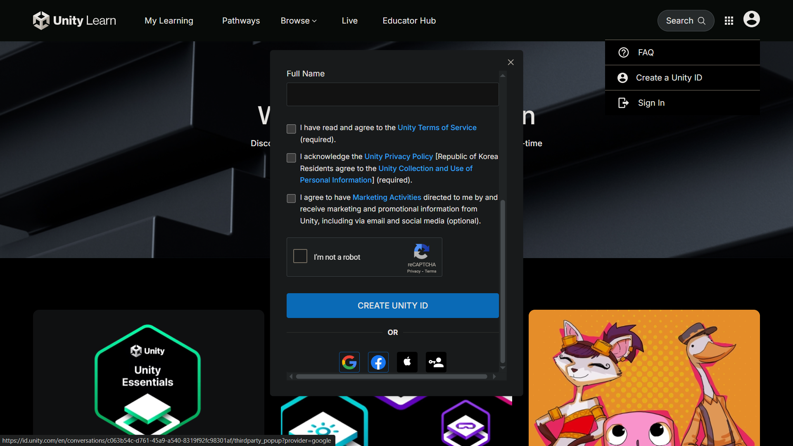
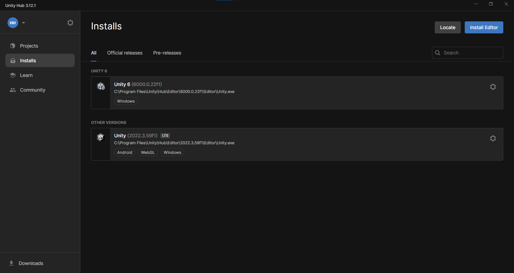

# مراحل نصب

- وارد وبسایت [Unity](https://unity.com) شوید و روی گزینه "Create a Unity ID" کلیک کنید. سپس اطلاعات مورد نیاز را وارد کنید یا از اکانت گوگل خود برای ثبت نام استفاده کنید. باز هم تاکید می‌کنم برای ورود به وبسایت باید از VPN استفاده شود.

- سپس از طریق این [لینک](https://unity.com/download) unity hub را دانلود و نصب کنید. unity hub صرفا برای نصب نرم افزار اصلی و مدیریت پروژه‌هاست.

- پس از نصب داخل نرم افزار، آخرین نسخه‌ی LTS نرم‌افزار 2022 را نصب کنید. می‌توانید راهنمای نصب کامل را در این [لینک](https://learn.unity.com/pathway/vr-development/unit/vr-basics/tutorial/0-1-set-up-unity-and-your-vr-device-1?version=2022.3) مشاهده کنید.

- با کلیک بر روی install editor، آخرین نسخه‌ی LTS 2022 را نصب کنید. باز هم تاکید می‌کنم به [وبسایت unity](https://learn.unity.com/pathway/vr-development/unit/vr-basics/tutorial/0-1-set-up-unity-and-your-vr-device-1?version=2022.3) مراجعه کنید تا نسخه‌ی پیشنهادی را نصب کنید. پیشنهاد می‌شود Android و WebGL را نصب کنید تا بتوانید خروجی apk برای عینک Oculus و همچنین خروجی وب داشته باشید. **دقت داشته باشید برای نصب نیاز به تغییر IP و سرعت بالای اینترنت بدون قطعی دارید وگرنه به مشکل می‌خورید.**
