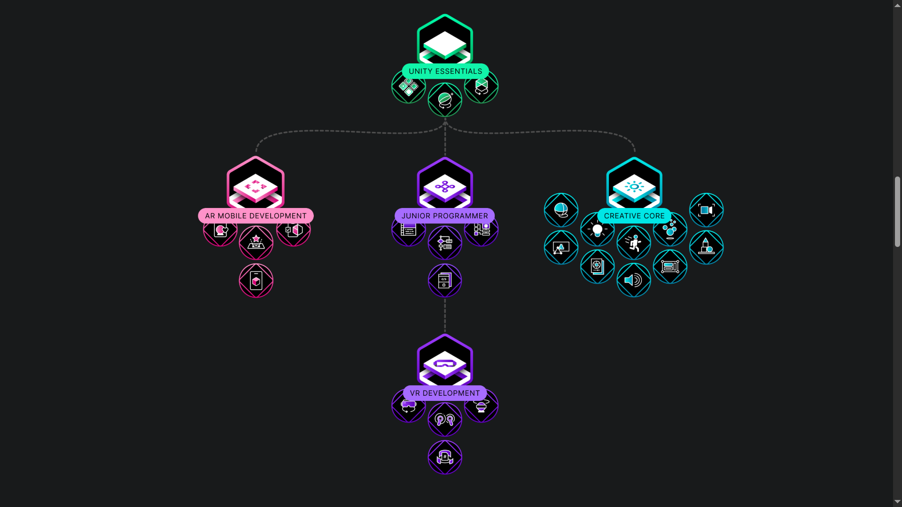

# مشاهده‌ی مسیر‌های یادگیری

- باز هم تاکید می‌کنم این داکیومنت صرفا برای یادگیری و توسعه‌ی سریعتر نوشته شده است. بهترین راه استفاده از آموزش‌های موجود در سایت unity برای یادگیری مرحله‌ به مرحله است.

- در لینک [Learning Pathways](https://learn.unity.com/pathways)، می‌توانید مسیر‌های یادگیری unity را مشاهده کنید.

- آموزش [Unity Essentials](https://learn.unity.com/pathway/unity-essentials)، [Junior Programming](https://learn.unity.com/pathway/junior-programmer) و [VR Development](https://learn.unity.com/pathway/vr-development) را می‌توانید در لینک‌های داده شده مشاهده کنید.

# یادگیری unity با کمک ساخت یک بازی

- این آموزش تمام مفاهیم نرم فزار (به همراه کد نویسی پایه) را با ساخت یک بازی دوبعدی توضیح می‌دهد. [The Unity Tutorial For Complete Beginners](https://www.youtube.com/watch?v=XtQMytORBmM&t=1574s) توصیه می‌کنم این آموزش را حتما مشاهده کنید.

