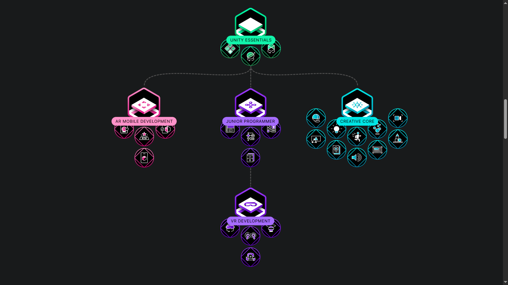
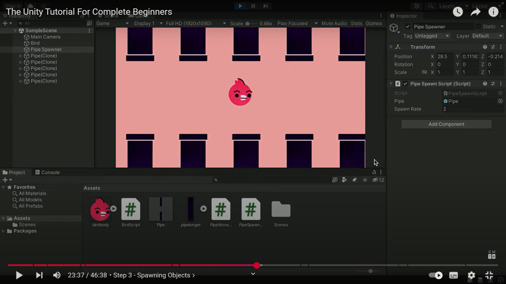

# راهنمای آغاز مسیر یادگیری Unity

## پیش‌نیازهای فنی و نصب

### الزامات شبکه و دسترسی

جهت کار بهینه با نرم‌افزار Unity و دسترسی به منابع آموزشی، **ضروری است** از یکی از موارد زیر استفاده نمایید:

- سرویس DNS معتبر و پایدار
- اتصال VPN با کیفیت مناسب

:::warning توجه
دانلود بسته‌های (Packages) پروژه‌ها نیازمند تغییر IP و پهنای باند قابل توجهی می‌باشد. عدم رعایت این موضوع منجر به اختلال در فرآیند توسعه خواهد شد.
:::

### نصب استاندارد Unity

برای نصب Unity، **حتماً** از [آخرین نسخه Unity Hub رسمی](https://unity.com/download) استفاده نمایید. از دانلود نرم‌افزار از منابع غیررسمی مانند soft98 یا سایر وب‌سایت‌های داخلی **اکیداً خودداری** کنید.

### انتخاب نسخه توسعه

برای پروژه‌های توسعه حرفه‌ای، **الزامی است** از [آخرین نسخه LTS (Long Term Support)](https://unity.com/releases/2022-lts) استفاده شود. این نسخه تضمین پایداری و پشتیبانی طولانی‌مدت را فراهم می‌کند.

## مسیرهای یادگیری رسمی Unity

### مسیرهای آموزشی پیشنهادی

Unity در بخش [Learning Pathways](https://learn.unity.com/pathways) مجموعه‌ای جامع از مسیرهای یادگیری ساختاریافته ارائه داده است. مسیرهای کلیدی عبارتند از:

| مسیر آموزشی                                                             | هدف                 | مناسب برای             |
| ----------------------------------------------------------------------- | ------------------- | ---------------------- |
| [Unity Essentials](https://learn.unity.com/pathway/unity-essentials)    | آشنایی با اصول پایه | مبتدیان مطلق           |
| [Junior Programming](https://learn.unity.com/pathway/junior-programmer) | برنامه‌نویسی پایه   | توسعه‌دهندگان تازه‌کار |
| [VR Development](https://learn.unity.com/pathway/vr-development)        | توسعه واقعیت مجازی  | متخصصان VR             |

### راهنمای تخصصی برای محدودیت زمانی

:::tip پیشنهاد ویژه
در صورت محدودیت زمانی، **حداقل** بخش اول آموزش Unity Essentials (از مجموع ۶ بخش) را مطالعه نمایید. این بخش مفاهیم بنیادی ضروری را پوشش می‌دهد.
:::

### نکات مهم برنامه‌نویسی

- برای پروژه‌های واقعیت مجازی، دانش برنامه‌نویسی پیشرفته **ضروری نیست**
- آشنایی پایه با زبان **C#** **شدیداً توصیه** می‌شود
- درک منطق برنامه‌نویسی شیءگرا مفید خواهد بود

## آموزش عملی: یادگیری از طریق پروژه

### پروژه آموزشی پیشنهادی

برای یادگیری عملی و جامع مفاهیم Unity (شامل اصول برنامه‌نویسی پایه)، آموزش زیر **قویاً توصیه** می‌شود:

**[The Unity Tutorial For Complete Beginners](https://www.youtube.com/watch?v=XtQMytORBmM&t=1574s)**

این آموزش ویدئویی شامل:

- تمامی مفاهیم بنیادی نرم‌افزار
- اصول کدنویسی پایه
- پیاده‌سازی عملی از طریق ساخت بازی ۲D کامل

:::info مزایای این رویکرد
یادگیری مبتنی بر پروژه (Project-Based Learning) باعث درک عمیق‌تر مفاهیم و کاربرد عملی آن‌ها در محیط واقعی توسعه می‌شود.
:::

