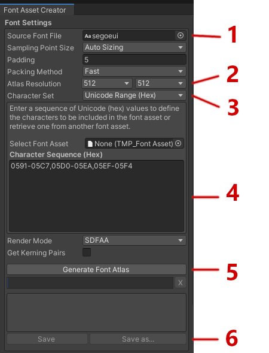
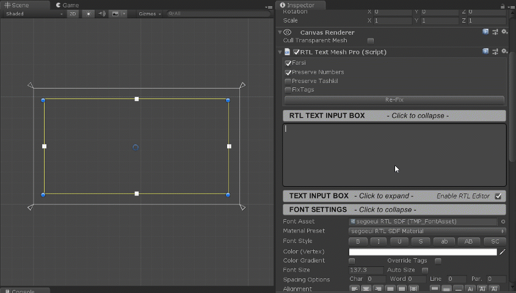

# نمایش متن فارسی در Unity

## [نصب Package](https://github.com/pnarimani/RTLTMPro)

- برای نمایش متن فارسی در Unity، لازم است از Package RTLTMPro استفاده کنید. براین نصب این Package، به این [آدرس](https://github.com/sorencoder/RTLTMPro/releases) بروید و آخرین نسخه UnityPackage را دانلود کنید. در Unity، به منوی `Assets > Import Package > Custom Package...` بروید و فایل `.unitypackage` دانلود شده را انتخاب کنید. در پنجره Import، تمام فایل‌ها را انتخاب کرده و `Import` کنید.

- نصب از طریق Package manager ممکن است مشکلاتی به وجود بیاورد.

## ایجاد فونت فارسی

- حالا لازم است یک فونت فارسی مانند [Vazirmatn](https://github.com/rastikerdar/vazir-font) یا [IRANSans](https://github.com/rastikerdar/iran-sans) یا [Samim](https://github.com/rastikerdar/samim-font) را دانلود کنید و داخل Unity آن را تنظیم کنید. به `Window > TextMeshPro > Font Asset Creator` بروید تا پنجره Font Asset Creator باز شود.

1. انتخاب **Atlas Size**: برای فارسی حداقل `512x512` ، برای کیفیت بهتر `1024x1024` و برای متن‌های زیاد یا اندازه‌های بزرگ `2048x2048` پیشنهاد می‌شود.

2. انتخاب **Character Set**: گزینه `Unicode Range` را انتخاب کنید.

3. فیلد **Character Sequence**: به پوشه `Assets/RTLTMPro/Ranges` بروید و `ArabicAll.txt` را باز کنید و تمام محتوای فایل را کپی کنید و آن را در فیلد `Character Sequence (Hex)` paste کنید.

4. **ایجاد Font**: روی دکمه `Generate Font Atlas` کلیک کنید. سپس روی `Save TextMeshPro Font Asset` کلیک کنید و در مکان مناسب Font Atlas را Save کنید.

   

## استفاده از متن فارسی در صحنه

- پس از ایجاد Font Asset، برای نمایش متن فارسی در صحنه، در Hierarchy کلیک راست کنید و روی `Create > UI >  Text - TextMeshPro - RTLTMP ` کلیک کنید. GameObject تولید شده خودکار دارای Component مخصوص RTL خواهد بود.

- در Inspector، تنظیمات زیر را اعمال کنید:

1.  **Font Asset**: Font Asset فارسی که در مرحله قبل ساختید را انتخاب کنید.

2.  **Text**: متن فارسی مورد نظر خود را وارد کنید.

3.  **Right To Left**: این گزینه باید به صورت خودکار فعال باشد. در غیر این صورت آن را فعال کنید.

4.  **Preserve Numbers**: این گزینه را فعال کنید تا اعداد به درستی نمایش داده شوند.

## تنظیمات VR

برای استفاده در پروژه‌های VR، تنظیمات اضافی لازم است:

1.  **Canvas تغییر**: Canvas خود را از Screen Space به `World Space` تبدیل کنید.

2.  **Event Camera**: فیلد Event Camera را به Main Camera صحنه assign کنید.

3.  **موقعیت**: Canvas را در موقعیت و اندازه مناسب برای VR قرار دهید.

4.  **Font Size**: اندازه فونت را بزرگتر از حالت معمولی انتخاب کنید تا در VR خوانایی بهتری داشته باشد.

## نکات مهم

- در صورتی که کاراکتری نمایش داده نمی‌شود، اطمینان حاصل کنید که آن کاراکتر در Character Sequence موجود باشد.

- اگر متن معکوس نمایش داده می‌شود، گزینه Right To Left را بررسی کنید.

- برای پروژه‌های موبایل، Atlas Size کمتر (512x512) انتخاب کنید تا حجم فایل کمتر باشد.

- همیشه پس از تغییر فونت یا تنظیمات، تست کنید که تمام کاراکترها به درستی نمایش داده می‌شوند.
