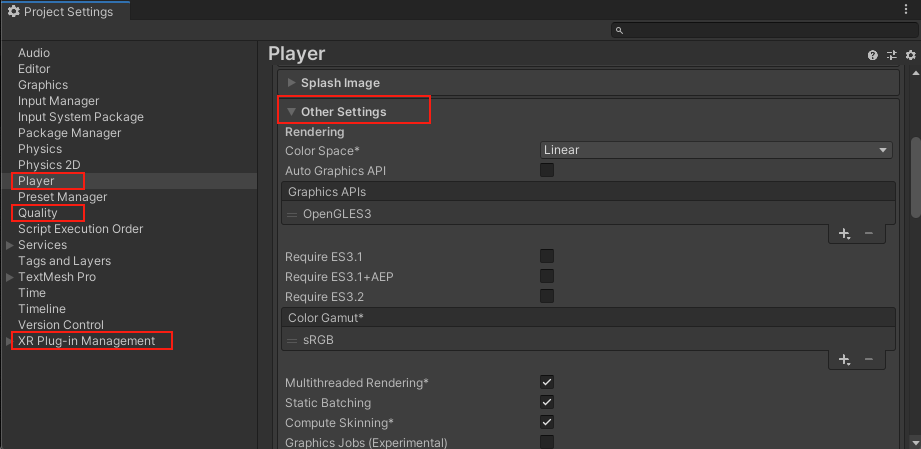
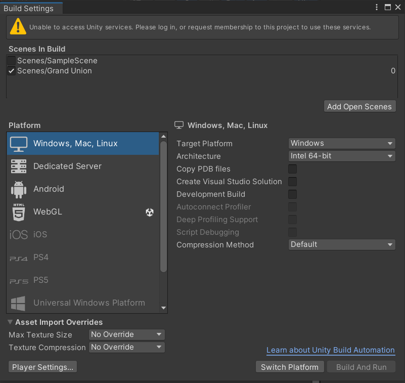

- راهنمای کامل را می‌توان [در این لینک](https://learn.unity.com/pathway/vr-development/unit/ergonomics-and-optimization/tutorial/3-4-building-and-sharing?version=2022.3) مشاهده کنید.

## تنظیمات OpenXR

- `Edit > Project Settings > XR Plug-in Management > OpenXR` بروید.

  - **Interaction Profiles**: فقط پروفایل‌های مربوط به هدست خود را فعال کنید:

  - **Quest**: Oculus Touch Controller Profile

  - **HTC Vive**: HTC Vive Controller Profile

  - **Valve Index**: Valve Index Controller Profile

- **Mock Runtime**: حتماً غیرفعال باشد.

- **XR Device Simulator**: حتما غیرفعال کنید.

## تنظیمات Player Setting

- `Player Settings` را باز کنید:

  - **Product Name**: نام نمایشی اپلیکیشن

  - **Company Name**: نام شرکت/سازنده

  - **Version**: شماره نسخه (1.0.0)

  - **Bundle Identifier** (Android): com.companyname.productname

  - **Default Icon**: آیکون 512x512 اپلیکیشن

#### تنظیمات خاص Android

- در `Player Settings > Android`:

      - **Configuration**: Release (برای انتشار)

      - **Scripting Backend**: IL2CPP

      - **Target Architectures**: فقط ARM64 ✓

      - **Minimum API Level**: API Level 29 (Android 10)

      - **Target API Level**: Automatic (Highest Installed)

      - **Install Location**: Automatic

#### تنظیمات خاص Windows

- در `Player Settings > PC, Mac & Linux Standalone`:

      - **Architecture**: x86_64

      - **Configuration**: Master

      - **Scripting Backend**: Mono

      - **Api Compatibility Level**: .NET Framework

#### تنظیمات WebGL خاص

- در `Player Settings > WebGL`:

      - **Compression Format**: پیش‌فرض نگه دارید (Gzip)

      - **Memory Size**: 2048 MB (حداقل برای VR)

      - **Exception Support**: None (برای بهینه‌سازی)

      - **Code Optimization**: Speed

      - **Managed Stripping Level**: Medium

      - **WebGL Template**: WebXR2020 (پس از نصب WebXR)

## تنظیمات Quality Settings

- `Edit > Project Settings > Quality` بروید:

1. **Android/Quest**:

   - سطح کیفیت **Medium** یا **Low**

   - **Texture Quality**: Half Res

   - **Anti Aliasing**: 2x Multi Sampling

2. **PC VR**:

   - سطح کیفیت **High** یا **Ultra**

   - **Texture Quality**: Full Res

   - **Anti Aliasing**: 4x Multi Sampling

3. **WebGL**:

   - سطح کیفیت **Low** یا **Medium**

   - **Texture Quality**: Half Res

   - **Anti Aliasing**: Disabled یا 2x

## نصب WebXR Export Package

- این Package برای اجرای برنامه در بستر web استفاده می‌شود. برای اینکه بخواهید با هدست در بستر وب برنامه را اجرا کنید، باید WebXR را نصب کنید و خروجی را به صورت WebGL بگیرید.

- در صورتی که بخواهید می‌توانید تنظیمات XR Device Simulator و Mock Runtime را نگه دارید و بدون WebXR، خروجی WebGL بگیرید و در بستر Web به کمک موس و کیبورد در صحنه حرکت کنید.

- تنظیمات Server در بخش بعدی توضیح داده خواهد شد.

#### روش نصب

- روش نصب را در [این لینک](https://github.com/De-Panther/unity-webxr-export/blob/master/Packages/webxr/README.md) می‌توانید مشاهده کنید.

  1.  `Edit > Project Settings > Package Manager` بروید.

  2.  **Scoped Registry** جدید اضافه کنید:

      - Name: OpenUPM

      - URL: https://package.openupm.com

      - Scope(s): com.de-panther

  3.  `Window > Package Manager` باز کنید

  4.  **Packages: My Registries** را انتخاب کنید

  5.  **WebXR Export** را پیدا کرده و `Install` کنید

  6.  اطمینان حاصل کنید که **WebXR Export** در `Project Settings > XR Plug-in Management > WebGL > Plug-in Providers` فعال باشد. همچنین WebGLTemplates را از طریق `Window > WebXR > Copy WebGLTemplates` کپی کنید.

## بیلد گرفتن

- از `ّFile > Build` را انتخاب کنید. در لیست **Platform**، پلتفرم هدف را انتخاب کنید:

  - **Android**: Quest 2/3، Pico، VIVE XR Elite

  - **Windows**: PC VR (Rift، Vive، Index، WMR)

  - **WebGL**: برای مرورگر با WebXR

- در صورتی که می‌خواهید برای platform غیر از windows بیلد بگیرید، `Switch Platform` کلیک کنید و منتظر import مجدد asset ها بمانید.

- سپس تنظیمات کیفیت گزینه‌ی build مانند تنظیمات Compression و Architecture را انجام دهید و روی گزینه‌ی build کلیک کنید.

  
