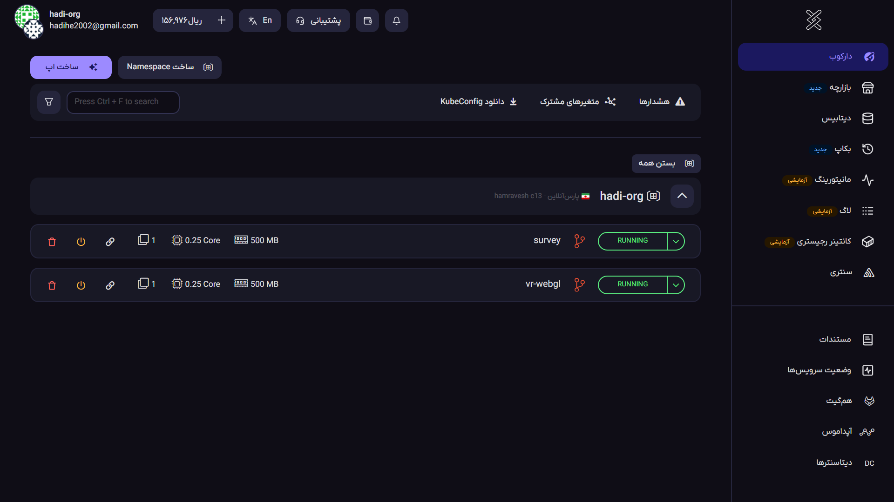

# راه‌اندازی و Deploy وب‌سرور برای WebXR/WebGL

برای انتشار پروژه‌های **WebXR** و **WebGL** ساخته‌شده در Unity، نیاز به پیکربندی وب‌سرور با تنظیمات خاص دارید.

:::tip راه حل توصیه‌شده
ساده‌ترین روش استفاده از **سرویس ابری همروش** است، اما می‌توانید از هر VPS یا سرویس cloud دیگری نیز استفاده کنید.
:::

:::info مرجع رسمی Unity
راهنمای کامل تنظیمات وب‌سرور: [Unity Web Server Configuration](https://docs.unity3d.com/2022.3/Documentation/Manual/web-server-config-nodejs.html)
:::

## پیش‌نیازها

### نصب Node.js

از [nodejs.org](https://nodejs.org/) آخرین نسخه **LTS** را دانلود و نصب کنید:

```bash
# تست صحت نصب
node --version
npm --version
```

## ایجاد پروژه وب‌سرور

### ساختار دایرکتوری

پروژه را در محل خروجی WebGL ایجاد کنید:

```bash
mkdir unity-webgl-server
cd unity-webgl-server
npm init -y
npm install express
```

### ساختار نهایی فایل‌ها

```
├── index.js
├── package.json
├── package-lock.json
├── node_modules/
├── output/
├── Build/
├── index.html
└── TemplateData/
└── Dockerfile
```

:::warning نکته مهم
فایل‌های **Web Build** شده Unity باید حتماً در پوشه `output` کپی شوند.
:::

## پیکربندی Express Server

فایل `index.js` را با محتوای زیر ایجاد کنید:

```javascript
#!/usr/bin/env node

const path = require("path");
const express = require("express");

// Create express application
const app = express();

// Settings
const hostname = "0.0.0.0";
const port = 8080;
const enableCORS = true;
const enableWasmMultithreading = true;
const buildPath = "./output";

app.use((req, res, next) => {
  res.setHeader("Access-Control-Allow-Origin", "*");
  res.setHeader("Access-Control-Allow-Methods", "GET,POST,PUT,DELETE,OPTIONS");
  res.setHeader("Access-Control-Allow-Headers", "Content-Type,Authorization");

  if (req.method === "OPTIONS") {
    return res.sendStatus(200);
  }

  var path = req.url;

  // Provide COOP, COEP and CORP headers for SharedArrayBuffer
  // multithreading: https://web.dev/coop-coep/
  if (
    enableWasmMultithreading &&
    (path == "/" ||
      path.includes(".js") ||
      path.includes(".html") ||
      path.includes(".htm"))
  ) {
    res.set("Cross-Origin-Opener-Policy", "same-origin");
    res.set("Cross-Origin-Embedder-Policy", "require-corp");
    res.set("Cross-Origin-Resource-Policy", "cross-origin");
  }

  // Set CORS headers
  if (enableCORS) {
    res.set("Access-Control-Allow-Origin", "*");
  }

  // Set content encoding depending on compression
  if (path.endsWith(".br")) {
    res.set("Content-Encoding", "br");
  } else if (path.endsWith(".gz")) {
    res.set("Content-Encoding", "gzip");
  }

  // Explicitly set content type
  if (path.includes(".wasm")) {
    res.set("Content-Type", "application/wasm");
  } else if (path.includes(".js")) {
    res.set("Content-Type", "application/javascript");
  } else if (path.includes(".json")) {
    res.set("Content-Type", "application/json");
  } else if (
    path.includes(".data") ||
    path.includes(".bundle") ||
    path.endsWith(".unityweb")
  ) {
    res.set("Content-Type", "application/octet-stream");
  }

  // Ignore cache-control: no-cache
  if (
    req.headers["cache-control"] == "no-cache" &&
    (req.headers["if-modified-since"] || req.headers["if-none-match"])
  ) {
    delete req.headers["cache-control"];
  }

  next();
});

app.use("/webgl", express.static(buildPath, { immutable: true }));

const server = app.listen(port, hostname, () => {
  console.log(`Server running at http://${hostname}:${port}`);
});

server.addListener("error", (error) => {
  console.error(error);
});

server.addListener("close", () => {
  console.log("Server stopped.");
  process.exit();
});
```

### اجرای محلی سرور

```bash
node ./index.js
```

سپس در مرورگر به آدرس `/webgl` مراجعه کنید.

## Deploy با همروش (توصیه‌شده)

### مرحله ۱: ایجاد Dockerfile

فایل `Dockerfile` را در کنار `index.js` ایجاد کنید:

```dockerfile
FROM node:18-alpine

WORKDIR /app

COPY package*.json ./

RUN npm install

COPY . .

EXPOSE 8080

CMD ["node", "index.js"]
```

### مرحله ۲: Git Repository

1. در [کنسول همروش](https://console.hamravesh.com) اکانت ایجاد کنید
2. در **همگیت** لاگین کنید
3. Repository جدید ایجاد کنید:

```bash
git init
git add .
git commit -m "Initial commit"
git remote add origin [YOUR-HAMGIT-REPO-URL]
git push -u origin master
```

### مرحله ۳: ایجاد اپلیکیشن

1. در کنسول همروش، اپ جدید **از منبع گیت** ایجاد کنید
2. Repository همگیت را انتخاب کنید
3. **Port سرویس** را `8080` تنظیم کنید
4. اپلیکیشن را ایجاد کنید

### مرحله ۴: تنظیم دامنه

1. از تنظیمات اپ، **آدرس دامنه** انتخاب کنید
2. تغییرات را ذخیره کنید
3. از **مشاهده اپ** وبسایت خود را ببینید



## Deploy بر روی VPS/Cloud دیگر

### روش‌های جایگزین

- **DigitalOcean**: App Platform یا Droplet
- **Heroku**: با buildpack Node.js
- **AWS**: EC2 یا Elastic Beanstalk
- **Google Cloud**: App Engine یا Compute Engine
- **Vercel**: پشتیبانی مستقیم از Node.js

### نمونه تنظیمات Nginx (اختیاری)

برای سرورهای با Nginx:

```nginx
server {
    listen 80;
    server_name your-domain.com;

    location /webgl {
        proxy_pass http://localhost:8080/webgl;
        proxy_set_header Host $host;
        proxy_set_header X-Real-IP $remote_addr;

        # WebXR headers
        add_header Cross-Origin-Opener-Policy same-origin;
        add_header Cross-Origin-Embedder-Policy require-corp;
        add_header Cross-Origin-Resource-Policy cross-origin;
    }
}
```

:::info نمونه کامل
نمونه پیاده‌سازی کامل: [VR WebGL Server Repository](https://github.com/hadihe2002/vr-webgl)
:::
