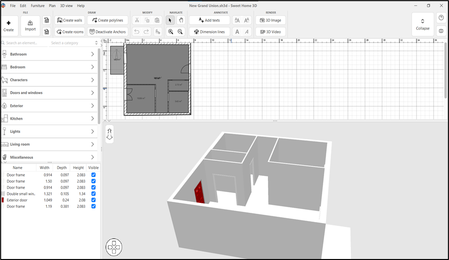

# راهنمای ایجاد مدل‌های سه‌بعدی و وارد کردن به Unity

## 1. طراحی مدل با Sweet Home 3D

### شروع کار با Sweet Home 3D

- نرم‌افزار را از Microsoft Store یا وبسایت رسمی دانلود و نصب کنید. این نرم‌افزار رایگان برای طراحی سریع اتاق‌ها و ساختمان‌های ساده بسیار مناسب است. پس از اجرا، یک پروژه جدید ایجاد کنید. در بخش Catalog سمت چپ، انواع دیوارها، درها، پنجره‌ها و مبلمان آماده موجود است. با drag and drop این عناصر را به Plan view اضافه کنید.
- برای ایجاد اتاق، از Room tool استفاده کرده و کنتور اتاق را رسم کنید. پس از ایجاد ساختار اصلی، می‌توانید texture ها، رنگ‌ها و lighting را تنظیم کنید. در 3D view می‌توانید نتیجه نهایی را مشاهده کنید و با camera controls (scroll، click و drag) زاویه مناسب را انتخاب کنید.
  

## 2. Export کردن از Sweet Home 3D

### تنظیمات Export برای Unity

- برای خروجی مناسب Unity، به `3D View > Export to OBJ format` بروید. در پنجره تنظیمات export، Quality را روی High تنظیم کنید و گزینه "Export textures" را حتماً فعال کنید. Width و Height را حداقل 1024 pixel انتخاب کنید تا کیفیت مناسبی داشته باشید. Include Ground را در صورت نیاز فعال کنید و اگر نمی‌خواهید کف اضافی داشته باشید آن را غیرفعال کنید.
- پس از کلیک روی Export، یک پوشه انتخاب کنید که فایل‌های .obj، .mtl و texture های مربوطه در آن ذخیره شوند. مطمئن شوید که تمام فایل‌ها (شامل textures) در همان پوشه قرار گرفته‌اند زیرا Unity به تمام آن‌ها نیاز دارد.

## 3. Import کردن به Unity

### وارد کردن فایل‌های OBJ

- پوشه export شده از Sweet Home 3D را به طور کامل به داخل Assets پروژه Unity کپی کنید. Unity به طور خودکار فایل .obj را تشخیص داده و یک GameObject ایجاد می‌کند. فایل OBJ را در Assets انتخاب کنید و در Inspector، تب Model را باز کنید.گزینه‌ی 1cm به 1m را غیرفعال کنید و Scale Factor را به 0.01 تغییر دهید. Generate Colliders را فعال کنید تا بتوان با مدل تعامل فیزیکی داشت. Read/Write Enabled را فعال کنید زیرا برای ProBuilderize لازم است.
- پس از اعمال تنظیمات، مدل را از Assets به Hierarchy بکشید. ممکن است ابتدا تکه‌تکه یا کج نمایش داده شود که این مشکل در مرحله بعد حل می‌شود.

## 4. استفاده از ProBuilderize برای تصحیح UV Map

### نصب و راه‌اندازی ProBuilder

- در Package Manager، "[ProBuilder](https://docs.unity3d.com/Packages/com.unity.probuilder@4.0/manual/Object_ProBuilderize.html)" را جستجو کرده و نصب کنید. پس از نصب، `Tools > ProBuilder > ProBuilder Window` را باز کنید تا پنجره **ProBuilder** نمایش داده شود. مدل وارد شده از Sweet Home 3D را در Hierarchy انتخاب کنید. تمام child object های مدل را انتخاب کنید. در ProBuilder Window، دکمه "ProBuilderize" را کلیک کنید. این عمل مدل را به فرمت ProBuilder تبدیل می‌کند و امکان ویرایش UV Maps را فراهم می‌کند **تا Material ها به درستی نمایش داده شوند.** Material ها برای ایجاد جنس و رنگ اشیا در صحنه استفاده می‌شود. در صورت انجام ندادن این تنظیمات Material به درستی نمایش داده نمی‌شود.
- این مشکل مخصوص به Sweet Home 3D است و ممکن است نرم‌افزار‌های دیگر مثل Revit، Blender و ... این مشکل مربوط به Material را نداشته باشند.

## 5. ایجاد Material های Custom

### دانلود Texture های با کیفیت

- از وبسایت‌های [Polyhaven.com](https://polyhaven.com/)، [AmbientCG.com](https://ambientcg.com/) و [TextureLabs.org](https://texturelabs.org/) texture های رایگان دانلود کنید. برای هر Material معمولاً به چهار نوع texture نیاز دارید: Diffuse/Albedo (رنگ اصلی)، Normal Map (جزئیات سطح)، Roughness (میزان صافی/زبری) و Metallic (خواص فلزی). Resolution مناسب برای VR معمولاً 1024x1024 یا 2048x2048 است.
- پس از دانلود، تمام texture های مربوط به یک Material را در یک پوشه در Assets قرار دهید. برای تنظیم Texture Type، فایل Normal Map را انتخاب کرده و در Inspector، Texture Type را روی "Normal map" تغییر دهید. سایر texture ها را روی "Default" نگه دارید اما Max Size را برای بهینه‌سازی به 1024 یا 512 کاهش دهید.

### ساخت Material با URP Shader

- در Assets کلیک راست کرده و `Create > Material` را انتخاب کنید. Material جدید را انتخاب کنید و در Inspector، Shader را روی "Universal Render Pipeline > Lit" تنظیم کنید. در بخش Surface Inputs، Albedo Map را texture اصلی، Normal Map را normal texture، Metallic Map را texture metallic و Smoothness Map را texture roughness تخصیص دهید.
- اگر texture جداگانه برای roughness ندارید، می‌توانید مقدار Smoothness را manually تنظیم کنید (0 = خیلی زبر، 1 = خیلی صاف). Tiling و Offset را تنظیم کنید تا texture به اندازه مناسب روی مدل نمایش داده شود. برای پیش‌نمایش نتیجه، Material را به مدل موجود در صحنه drag کنید. اگر Material خیلی روشن یا تیره است، Base Color Tint را تنظیم کنید.

## 6. دانلود مدل‌های سه بعدی آماده از SketchFab

### انتخاب و دانلود مدل‌های مناسب

- به وبسایت [Sketchfab.com](https://sketchfab.com/3d-models) بروید و در بخش Filters، گزینه "Free" را انتخاب کنید تا فقط مدل‌های رایگان نمایش داده شوند. همچنین فیلتر "Downloadable" را فعال کنید. برای پروژه‌های VR، مدل‌هایی با Poly Count پایین (زیر 10K triangles) انتخاب کنید تا Performance خوبی داشته باشید. پس از انتخاب مدل، روی "Download" کلیک کنید و فرمت "Original format" یا "glTF" را انتخاب کنید.
- برای استفاده از فایل‌های **glTF** در Unity، حتماً [پکیج](https://github.com/atteneder/glTFast) "glTFast" را از Package Manager نصب کنید. فایل دانلود شده را Extract کرده و فولدر حاوی فایل‌های مدل را به Assets پروژه Unity کپی کنید. Unity خودکار مدل را import کرده و در Assets نمایش می‌دهد.

## 7. استفاده از نرم‌افزارهای پیشرفته (3ds Max / Blender)

- برای طراحی مدل‌های سه بعدی پیچیده‌تر، می‌توانید از Blender، Revit و یا 3ds Max را استفاده کنید.
