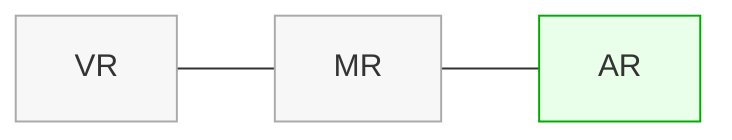

# 01 — واقعیت افزوده (AR) چیست؟
> این فصل برای کسی نوشته شده که می‌خواهد از صفر بداند «AR دقیقاً چیست»، چه تفاوتی با VR/MR/XR دارد، چطور کار می‌کند، و چه مفاهیم پایه‌ای را باید پیش از ورود به یونیتی بداند—بدون ارجاع به هیچ اپلیکیشن یا دامنهٔ خاص.

- **چکیده:** واقعیت افزوده *تصویر زندهٔ دنیای واقعی* را با *لایه‌های محتوای دیجیتال* ترکیب می‌کند، به‌طوری‌که اشیای مجازی در مکان و زمان درست، هم‌مکان با محیط دیده شوند. ستون فقرات فنی AR «ردیابی» (Tracking) و «ثبت مکانی/مقیاسی» (Registration/Scale) است؛ بدون آن، AR فقط یک دوربین با استیکر است.
- **پس از مطالعهٔ این فصل می‌توانید:** تفاوت AR/VR/MR را توضیح دهید، مفاهیم Anchor/Plane/Raycast/Pose/Scale را بفهمید، مسیر داده از حسگر تا رندر را توصیف کنید، و معیارهای اینکه «کجا AR توجیه دارد» را بیان کنید.

---

## 1) تعریف‌ها و تفاوت‌ها (AR vs. VR vs. MR vs. XR)
- **AR (Augmented Reality)**: محتوای دیجیتال روی دنیای واقعی «افزوده» می‌شود؛ کاربر *محیط واقعی* را می‌بیند.
- **VR (Virtual Reality)**: محیط کاملاً مجازی؛ کاربر دنیای واقعی را نمی‌بیند (هدست‌های تمام‌پوش).
- **MR (Mixed Reality)**: طیفی بین AR و VR؛ اشیای مجازی *برهم‌کنش‌های بصری/ادراکی* غنی‌تری با دنیای واقعی دارند (انسداد/Occlusion، روشنایی، برخورد).
- **XR (Extended Reality)**: چتر مفهومی برای همهٔ موارد بالا.

### نمودار مفهومی


### جدول مقایسه
| شاخص | AR | VR | MR |
|---|---|---|---|
| دیدن دنیای واقعی | بله (دوربین/گذردهنده) | خیر | بله |
| حس حضور | واقعی + افزوده | کاملاً مجازی | افزودهٔ غنی‌تر |
| سخت‌افزار رایج | موبایل، عینک سبک | هدست VR | HMDهای پیشرفته، موبایل‌های LiDAR |
| تعامل معمول | لمس/ژست، نگاه+اشاره | کنترلر/ژست | ژست/نگاه/کنترلر |
| سناریو نمونه | آموزش، نگهداشت، راه‌یابی، سرگرمی | بازی/شبیه‌سازی | طراحی/تعمیرات پیشرفته |

> **برداشت کلیدی:** AR مناسب کارهایی است که «محیط واقعی» محور اصلی است و نیاز به زمینهٔ مکانی/مقیاسی دارد.

---

## 2) AR چگونه کار می‌کند؟ (نمای 1000 فوت)
ایدهٔ ساده است: **حسگرها → ردیابی (Tracking) → درک صحنه (Plane/Anchor) → رندر محتوای سه‌بعدی در موقعیت درست**.

```mermaid
flowchart LR
  CAM[دوربین RGB] -->|فریم‌ها| TRACK[ردیابی دیداری-اینرسیایی (VIO/SLAM)]
  IMU[شتاب‌سنج/ژیروسکوپ] --> TRACK
  TRACK --> POSE[برآورد Pose دستگاه]
  POSE --> RAY[Raycast به صحنهٔ بازسازی‌شده/Planes]
  RAY --> ANCHOR[Anchor گذاری پایدار]
  ANCHOR --> RENDER[رندر سه‌بعدی با میدان دید/نور درست]
```

- **VIO/SLAM:** از الگوهای تصویری + IMU برای تخمین *Pose* (موقعیت/زاویه) دستگاه در زمان استفاده می‌کند.
- **Plane Detection:** از نقاط شاخص (Feature Points) سطوحی مانند زمین/میز/دیوار را استنتاج می‌کند.
- **Anchor:** یک مرجع مکانی پایدار تا محتوای مجازی «سر نخورد».

> اگر Tracking ناپایدار باشد ⇒ محتوای AR می‌لرزد/می‌پرد/جا به جا می‌شود.

---

## 3) مفاهیم پایهٔ فضایی
- **Coordinate System (Right-handed در یونیتی):** محورهای X (راست/چپ), Y (بالا/پایین), Z (جلو/عقب). واحد پیش‌فرض **متر** است.
- **Pose = Position + Rotation:** تابع زمان است؛ هر فریم به‌روزرسانی می‌شود.
- **World Scale:** مقیاس فیزیکی دنیای مجازی نسبت به واقعی (۱ واحد در یونیتی = ۱ متر). عدم همخوانی، باورپذیری را از بین می‌برد.
- **Calibration:** نگاشت mm (دادهٔ واقعی) ↔ m (جهان AR). مثال: عرض واقعی ۹۰۰ mm باید ~۰٫۹ m شود.
- **Raycast:** پرتوی فرضی از دوربین/صفحه به صحنه برای پیدا کردن برخورد با Planeها یا Meshes.
- **Anchor:** شیء مرجع پایدار؛ محتوای AR معمولاً به‌صورت Child آن قرار می‌گیرد.

---

## 4) سخت‌افزار و سنسورها (مختصر)
- **موبایل AR (متداول):** دوربین RGB، IMU؛ برخی مدل‌ها LiDAR/ToF دارند (دقت عمق بهتر، Plane سریع‌تر).
- **هدست‌ها:** میدان دید بیشتر و رهگیری بهتر، اما هزینه و قیود استقرار بالاتر.
- **نور و بافت محیط:** سطح‌های بدون بافت (دیوار سفید) یا نور خیلی شدید/کم → ردیابی سخت می‌شود.

> برای شروع، یک گوشی میان‌ردهٔ اندرویدی پشتیبانی‌شده توسط ARCore کفایت می‌کند.

---

## 5) درک صحنه: Feature Points، Plane، Anchor
- **Feature Points:** نقاط بافت‌دار که بین فریم‌ها قابل‌پیگیری‌اند.
- **Plane:** سطح تقریبی از خوشه‌ای از Feature Points (افقی/عمودی). برای چیدن محتوا مناسب است.
- **Anchor:** نقطه/چارچوب محلی که به Plane (یا فضای آزاد) قفل می‌شود و در زمان پایدار می‌ماند.

**الگوی کار رایج:**
1. کاربر سطح (Plane) را ببیند (Visualization).
2. کاربر Tap کند → Raycast به Plane → Anchor ایجاد شود.
3. محتوای سه‌بعدی در زیرشاخهٔ Anchor قرار گیرد.

---

## 6) ثبت مکانی و مقیاس (Registration & Scale)
اگر دادهٔ دنیای واقعی شما در **میلی‌متر** است و جهان یونیتی **متر** است:
- نسبت تبدیل: `meters_per_mm = measured_distance_in_meters / true_distance_in_mm`  
- سپس *تمام* ابعاد مدل/اشیای مجازی را در این نسبت ضرب کنید.

**فلو دو-نقطه‌ای:**
1. کاربر دو نقطهٔ مرجع را Tap می‌کند.
2. فاصلهٔ سه‌بعدی دو Anchor را از AR می‌گیریم (متر).
3. با دانستن فاصلهٔ واقعی (mm)، نسبت `m/mm` را محاسبه می‌کنیم.
4. تمام رندرها ⇒ در مقیاس صحیح نمایش داده می‌شوند.

---

## 7) چه زمانی AR مناسب است؟ (کاربرد و معیار تصمیم)
**کاربردهای عمومی:**
- *آموزش/ایمنی*: دستورالعمل مرحله‌به‌مرحله روی تجهیزات واقعی.
- *نگهداشت/تعمیر*: نشان‌دادن قطعات/مراحل.
- *راه‌یابی*: جهت‌دهی داخل محیط‌های پیچیده.
- *سرگرمی/نمایش*: تجربه‌های تعاملی بر بستر واقعیت.

**معیارها (سریع):**
- **وابستگی به مکان واقعی؟** بله ⇒ AR محتمل است.
- **نیاز به مقیاس واقعی/ابعاد؟** بله ⇒ برنامهٔ کالیبراسیون ضروری.
- **مزاحمت برای کار اصلی کاربر؟** باید کم باشد (UX ساده، بدون اسکرین‌های پیچیده).
- **زمان/هزینهٔ استقرار؟** موبایل معمولاً بر هدست ارجح است.

---

## 8) خطاهای رایج در شروع کار
- **مقیاس اشتباه:** تبدیل mm↔m رعایت نشده یا نقاط مرجع دقیق انتخاب نشده‌اند.
- **Raycast به فضای خالی:** باید نوع Trackable را درست انتخاب کنید (Plane vs Feature Point).
- **ریزش فریم:** شفافیت/Outline سنگین، Instantiate زیاد.
- **خوانایی متن فارسی:** TMP بدون پشتیبانی RTL → حروف جدا/معکوس؛ از RTLTMPro/معادل استفاده کنید.
- **نور محیط:** خیلی تاریک/روشن ⇒ Tracking ضعیف → اشیا می‌لرزند.

---

## 9) مفاهیم کلیدی قبل از یونیتی
- **Session**، **Origin/Camera**، **Trackables** (Planes/Points/Faces)، **Managers** (Plane/Raycast/Anchor)، **Scene Graph**، **Units & Scale**.

---

## 10) واژه‌ها و نمادها (نگاه سریع)
| واژه | معنی کوتاه |
|---|---|
| **Pose** | موقعیت + چرخش دوربین/شیء |
| **Anchor** | مرجع مکانی پایدار برای قفل‌کردن محتوا |
| **Raycast** | پرتوی برخورد به سطح برای تعیین نقطهٔ تماس |
| **Plane** | سطح کشف‌شده از نقاط شاخص (افقی/عمودی) |
| **Feature Point** | نقطهٔ بافت‌دار قابل‌پیگیری در تصویر |
| **SLAM/VIO** | الگوریتم‌های ردیابی دیداری-اینرسیایی |
| **FoV** | میدان دید دوربین |
| **Occlusion** | انسداد: پنهان شدن بخشی از شیء مجازی پشت واقعی |

> واژه‌نامهٔ کامل در `15-glossary.md` خواهد آمد.

---

## 11) نکات کلیدی فصل
- AR یعنی **افزودن دقیق و مقیاس‌دار** محتوای دیجیتال به دنیای واقعی؛ بدون Tracking/Calibration کافی، کیفیت تجربه پایین است.
- تفاوت AR/VR/MR را از زاویهٔ «دیدن دنیای واقعی» و «عمق برهم‌کنش» به‌خاطر بسپارید.
- در پروژه‌های واقعی، **مقیاس**، **Raycast درست** و **Anchor پایدار** مهم‌تر از جلوه‌های بصری‌اند.
- برای شروع، یک گوشی ARCore/ARKit کافی است؛ از ساده‌ترین مسیر آغاز کنید.
