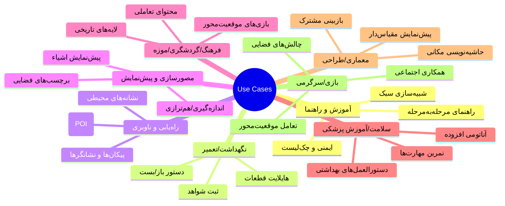

# 02 — کاربردهای AR در دنیای واقعی (عمومی)
> این فصل یک نقشهٔ جامع از سناریوهای متداولِ AR، معیارهای انتخاب، ریسک‌ها و شاخص‌های ارزیابی ارائه می‌دهد—بدون اشاره به هیچ اپلیکیشن یا دامنهٔ خاص. اگر تازه‌کار هستید، این فصل به شما کمک می‌کند بفهمید «کِی AR گزینهٔ درستی است» و «چه انتظاری باید از آن داشت».

- **چکیده:** AR وقتی می‌درخشد که به *زمینهٔ مکانی* و *مقیاس واقعی* نیاز داریم، یا اطلاعات باید دقیقاً در جای درستِ محیط نمایش داده شود. در غیر این صورت، یک اپ 2D شاید ساده‌تر و ارزان‌تر باشد.
- **پس از مطالعهٔ این فصل می‌توانید:** طیف کاربردهای AR را دسته‌بندی کنید، برای یک ایدهٔ خام یک سناریوی تعامل تعریف کنید، و ریسک/سود (ROI) اولیه را بسنجید.

---

## 1) نقشهٔ کاربردها (Taxonomy)


> این دسته‌بندی‌ها هم‌پوشانی دارند؛ یک تجربهٔ AR می‌تواند چند محور را ترکیب کند (مثلاً «آموزش + حاشیه‌نویسی مکانی»).

---

## 2) الگوهای تعامل (Interaction Patterns)
### 2.1 برچسب‌گذاری فضایی (Spatial Annotation)
- قرار دادن متن/آیکون/اسکیما **در محل درست** محیط.
- مناسب برای توضیح، هشدار، اشاره به مکان یا اندازه‌گیری.

### 2.2 پیش‌نمایش و جای‌گذاری (Preview & Placement)
- نشان‌دادن یک شیء مجازی در محیط واقعی با مقیاس و جهت مناسب.
- نیازمند **Plane**/Raycast و گاهی **Anchor**های پایدار.

### 2.3 راهنمای گام‌به‌گام (Guided Steps)
- نمایش «گام فعلی» + «فیدبک فوری» (درست/اشتباه/ناقص).
- بسیار وابسته به **خوانایی** و **زمان‌بندی** پیام‌ها.

### 2.4 راه‌یابی (Wayfinding)
- پیکان‌ها/نشانگرهای نیمه‌شفاف در محیط؛ گاهی **نشانه‌های جهان واقعی** برای هم‌ترازی.

### 2.5 همکاری و هم‌زمانی (Collaborative AR) _(پیشرفته)_
- به‌اشتراک‌گذاری Space/Anchor میان چند دستگاه؛ نیازمند همگام‌سازی دقیق و شبکه.

---

## 3) تصمیم‌گیری: آیا AR انتخاب مناسبی است؟
```mermaid
flowchart TD
  A{نیاز به زمینهٔ مکانی داری؟} -->|خیر| B[اپ 2D ساده‌تر است]
  A -->|بله| C{اندازه/مقیاس واقعی مهم است؟}
  C -->|خیر| D[شاید ویدئو/اینفوگرافیک کافی باشد]
  C -->|بله| E{محیط برای ردیابی مناسب است؟ (نور/بافت/فضا)}
  E -->|خیر| F[پیش‌نیازهای محیطی را فراهم کن یا گزینهٔ دیگر]
  E -->|بله| G{کاربر دستگاه مناسب دارد؟}
  G -->|خیر| H[محدودیت استقرار: بازنگری دامنه]
  G -->|بله| I[AR توجیه‌پذیر است → نمونهٔ کوچک بساز]
```

**قواعد سرانگشتی:**
- اگر اهمیت «*کجا*» و «*چه اندازه*» پایین است، AR مزیت کمی دارد.
- اگر محیط تاریک/یکنواخت/شلوغ است، کیفیت Tracking افت می‌کند.
- در فاز اول، **نمونهٔ کوچک** بسازید و KPIها را اندازه بگیرید.

---

## 4) سنجه‌های موفقیت (KPI) و ارزیابی اولیه
| محور | KPI نمونه | چطور بسنجیم؟ |
|---|---|---|
| کارایی | زمان انجام وظیفه (s)، نرخ خطا (%) | آزمون کاربر با سناریوی ثابت |
| قابلیت استفاده | SUS/UMUX-Lite، نرخ تکمیل (%) | پرسشنامه + مشاهده |
| درک فضایی | درصد تراز صحیح، اختلاف مقیاس (cm) | اندازه‌گیری میدانی |
| پایداری فنی | FPS متوسط/حداقل، کرش/ANR | پروفایلینگ + لاگ |
| پذیرش | NPS/CSAT، قصد استفادهٔ مجدد | فرم پس از استفاده |
| یادگیری | نرخ یادسپاری (Recall) | آزمون پیش/پس از آموزش |

> هرگز صرفاً به «جذابیت» تکیه نکنید؛ دادهٔ کمی لازم است.

---

## 5) محیط و شرایط عملیاتی
| عامل محیطی | اثر بر Tracking | راهکار |
|---|---|---|
| نور خیلی کم/زیاد | افت تشخیص Feature Points | افزایش نور یکنواخت/پراکنش؛ اجتناب از ضدنور مستقیم |
| سطوح براق/شفاف | بازتاب/شکست نور → خطا | از سطوح مات استفاده کنید یا زاویهٔ دوربین را تغییر دهید |
| بافت کم (دیوار سفید) | مرجع تصویری کم | افزودن بافت/نشانهٔ بصری موقت |
| لرزش دست شدید | نویز در Pose | تثبیت دست، راهنمایی سرعت حرکت |
| فضای تنگ/ازدحام | انسداد مکرر | زاویهٔ دید مناسب، قفل Anchorها |

---

## 6) طراحی UX ویژهٔ AR (خلاصهٔ عملی)
- **دکمه‌ها و متن‌ها بزرگ‌تر از اپ‌های 2D** (≥ 44dp لمس، ≥ 16sp متن).
- **کنتراست بالا** و **Outline ملایم** برای اشیای AR؛ در نور متغیر هم خوانا بماند.
- **فاصلهٔ ایمن**: محتوا را خیلی نزدیک دوربین قرار ندهید (سرگیجه/تداخل).
- **بازخورد لحظه‌ای**: هر عمل کاربر باید پاسخ بصری/شنیداری کوتاه داشته باشد.
- **محلی‌سازی/RTL**: با TextMeshPro و پشتیبانی RTL، جهت متن و اعداد را درست نمایش دهید.
- **هدایت کاربر**: از Tooltips کوتاه ۱–۲ خطی استفاده کنید؛ قابل خاموش‌کردن.

نمونهٔ چیدمان لایه‌ها (طرح شماتیک):
```
[ Overlay UI (دکمه‌ها/راهنما) ]
[ محتوای AR در جهان سه‌بعدی    ]
[ تصویر دوربین (پس‌زمینه)      ]
```

---

## 7) حریم خصوصی، ایمنی و اخلاق
- **دوربین همیشه روشن**: فقط دادهٔ لازم را نگه دارید؛ به کاربر اطلاع بدهید.
- **دسترسی‌ها**: دوربین/حافظه را شفاف توضیح دهید.
- **ایمنی فیزیکی**: هشدار دربارهٔ حرکت در حین نگاه‌کردن به صفحه؛ اجتناب از پوشاندن مسیر دید.
- **اطلاعات حساس**: مکان و تصویر اشخاص/دارایی‌ها را محافظت کنید.

---

## 8) ریسک‌های فنی رایج و کاهش آن‌ها
| ریسک | نشانه‌ها | کاهش/پیشگیری |
|---|---|---|
| Tracking ناپایدار | پرش/لرزش محتوا | نور/بافت مناسب، قفل Anchor، جلوگیری از حرکت‌های تند |
| مقیاس غلط | ناسازگاری اندازه‌ها | کالیبراسیون دو-نقطه، راستی‌آزمایی میدانی |
| ریزش فریم | FPS پایین، تاخیر ورودی | محدودکردن شفافیت، کاهش Draw Call، Pooling پرِفب |
| ناسازگاری دستگاه | کرش/ویژگی غیرفعال | فهرست پشتیبانی ARCore/ARKit، چک زمان اجرا |
| UX مبهم | خطا/ابهام کاربران | متن‌های کوتاه، آیکون‌های واضح، تست کاربری تکرارشونده |

---

## 9) جدول نگاشت «کاربرد ↔ نیازمندی» (نمونهٔ عمومی)
| کاربرد عمومی | نوع تعامل غالب | تکیه‌گاه مکانی | محتوای رایج | پیچیدگی نسبی | ریسک برجسته |
|---|---|---|---|---|---|
| آموزش گام‌به‌گام | Tooltip/Step | Plane/Anchor | متن/آیکون/پیکان | متوسط | خوانایی/بار شناختی |
| پیش‌نمایش شیء | Placement/Scale | Plane | Mesh ساده/Proxy | کم تا متوسط | مقیاس/نور |
| راه‌یابی داخلی | Arrow/POI | نشانه‌های محیطی | مسیر/مارکر | متوسط | انسداد/تداخل دید |
| حاشیه‌نویسی مکانی | Annotation | Anchor | برچسب/هایلایت | کم | ثبت پایدار |
| همکاری چندکاربره | Sync/Share | Anchor مشترک | همهٔ موارد بالا | بالا | شبکه/همگام‌سازی |

---

## 10) برنامهٔ پایلوت و ارزیابی (چارچوب پیشنهادی)
1. **تعریف سناریو**: هدف، کاربر، محیط، قیود.
2. **نمونهٔ کوچک**: فقط مسیر «ارزش» را بسازید (Happy Path).
3. **پروتکل تست**: تعداد شرکت‌کننده، وظایف، سنجه‌ها (بخش KPI).
4. **جمع‌آوری داده**: زمان، خطا، پرسشنامه، لاگ‌های فنی.
5. **تحلیل**: مقایسه با معیار پایه (بدون AR یا روش فعلی).
6. **تصمیم**: ادامه/اصلاح/توقف + نقشهٔ بهبود.

چک‌لیست اجرا
- [ ] دستگاه‌های آزمون انتخاب شده‌اند (حداقل یک میان‌رده)
- [ ] محیط آزمون پایدار است (نور/بافت مناسب)
- [ ] دستورالعمل آزمون کوتاه و شفاف
- [ ] ثبت رخدادها فعال (JSON/CSV)
- [ ] فرم‌های رضایت‌نامه و حریم خصوصی آماده

---

## 11) هزینه و محتوا (مختصر راهبردی)
- **تولید محتوا**: مدل سه‌بعدی/متریال/فونت/آیکون—گاهی از **Proxy/Bounding** ساده به‌جای مدل دقیق استفاده کنید.
- **نگهداری**: هر تغییری در دنیای واقعی (چیدمان/فضا/نصب‌ها) ممکن است به **بازکالیبراسیون** نیاز داشته باشد.
- **زنجیرهٔ ابزار**: مدیریت نسخه‌های Unity/پکیج‌ها، اتوماسیون بیلد، تست دستگاهی.

---

## 12) نکات کلیدی فصل
- AR زمانی ارزش‌افزا است که **مکان** و **مقیاس** اهمیت دارند.
- با **نمونهٔ کوچک و قابل‌اندازه‌گیری** شروع کنید؛ KPIها را از روز اول تعریف کنید.
- محیط مناسب (نور/بافت) و UX شفاف، موفقیت را تعیین می‌کنند.
- ریسک‌های رایج (Tracking، مقیاس، FPS، UX) را از ابتدا مدیریت کنید.
- احترام به **حریم خصوصی** و **ایمنی فیزیکی** بخشی از طراحی است.

---

### پیوست — الگوی یک «کارت سناریو» (قابل کپی)
```
نام سناریو: ...........................................
کاربر اصلی: ............................. محیط: ........
هدف کلیدی: ............................................
الگوی تعامل: ............................ تکیه‌گاه: ....
KPIها: .................................................
ریسک‌ها/پیش‌نیازها: ....................................
برنامهٔ پایلوت: تاریخ/شرکت‌کننده/وظایف/معیارها ........
معیار موفقیت: .........................................
```
