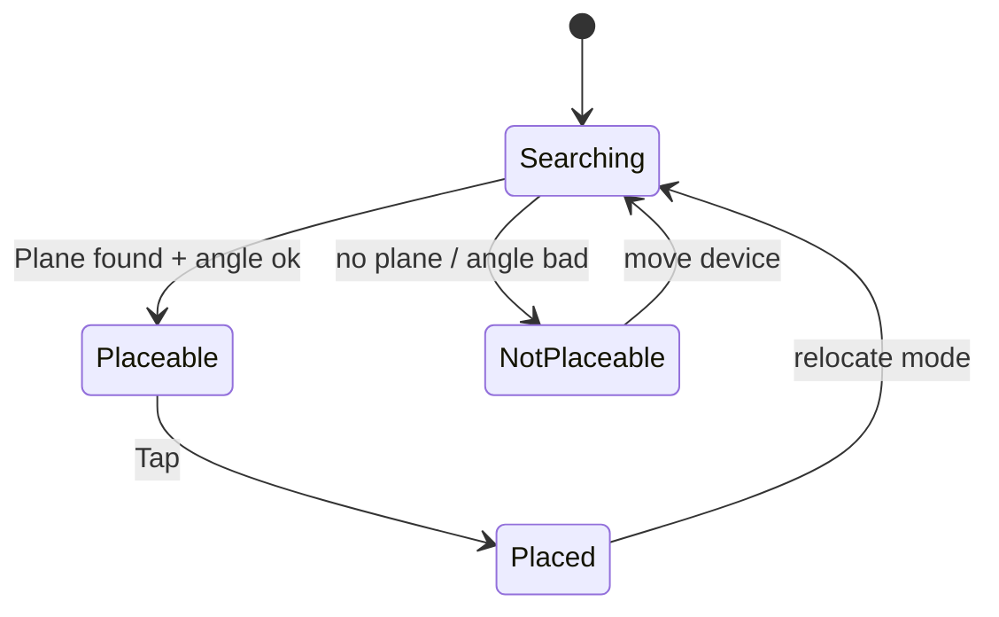

# 07 — اصول UX در واقعیت افزوده (با نکات RTL)
> این فصل یک راهنمای عملی برای طراحی تجربهٔ کاربری در AR است: از خوانایی و لایه‌بندی تا تعامل‌های لمسی، راهنمایی محیطی، ایمنی، چندزبانه/RTL و دسترس‌پذیری. مثال‌ها **عمومی** هستند و به اپلیکیشن خاصی اشاره نمی‌کنند.

- **چکیده:** UX در AR با اپ‌های 2D فرق دارد؛ محتوا در دنیای واقعی شناور است، نور/بافت تغییر می‌کند، و مقیاس و فاصلهٔ ادراکی نقش اصلی دارند. موفقیت UX در AR به تعادل **سادگی، خوانایی، بازخورد لحظه‌ای و ایمنی** بستگی دارد.
- **پس از مطالعه:** می‌توانید یک سیستم طراحی سبک برای AR بسازید، UI را لایه‌بندی کنید، اندازه‌ها/فاصله‌ها را منطقی انتخاب کنید، و تجربه‌ای قابل‌استفاده برای زبان‌های راست‌به‌چپ ارائه دهید.

---

## 1) اصول راهبردی
1. **ساده نگه دارید**: در هر لحظه یک هدف/گام روشن. از شلوغی بصری بپرهیزید.
2. **بازخورد فوری**: هر عمل (Tap/Drag/Scan/Confirm) باید بازخورد بصری/شنیداری کوتاه داشته باشد.
3. **خوانایی در نور متغیر**: متن/آیکون‌ها باید در محیط‌های تاریک/روشن خوانا بمانند (کنتراست بالا).
4. **مقیاس و فاصلهٔ ایمن**: محتوای سه‌بعدی را نه خیلی نزدیک (سرگیجه) و نه خیلی دور (غیرقابل‌خواندن) قرار دهید.
5. **قابل کشف بودن تعامل‌ها**: Reticle، سایهٔ تماس (Contact Shadow) و Tooltips کوتاه.
6. **احترام به محیط و ایمنی**: هشدار بدهید که کاربر هنگام حرکت مراقب محیط باشد.

---

## 2) لایه‌بندی تجربه (Stack)
```mermaid
flowchart TB
  subgraph Device Screen
    A[Camera Feed (Background)]
    B[3D World Content (AR Objects/Anchors)]
    C[World-space Labels & Gizmos]
    D[Screen-space UI (HUD/Buttons/Prompts)]
    E[System Messages/Toasts/Modals]
  end
  A --> B --> C --> D --> E
```
- **Camera Feed**: پس‌زمینهٔ زندهٔ جهان واقعی.
- **3D World Content**: اشیای مجازی/Proxy.
- **World-space Labels**: برچسب‌ها/پیکان‌ها که همراه شیء حرکت می‌کنند.
- **Screen-space UI**: دکمه‌ها، نوار وضعیت، راهنما.
- **System Messages**: خطاها، مجوزها، هشدارها.

**قاعده:** اطلاعات مرتبط با **مکان** را در **World-space** نشان دهید؛ کنترل‌های عمومی در **Screen-space**.

---

## 3) تایپوگرافی، اندازه‌ها و فاصله‌ها
### 3.1 مقادیر پیشنهادی (موبایل)
| مورد | حداقل توصیه |
|---|---|
| **اندازهٔ لمس** | ≥ 44dp |
| **اندازهٔ متن بدنه** | ≥ 16sp |
| **عنوان کوچک** | 18–20sp |
| **کنتراست متن/پس‌زمینه** | 4.5:1 یا بالاتر |
| **حاشیهٔ ایمن لبه‌ها** | ≥ 16dp |

### 3.2 برچسب‌های World-space
| فاصلهٔ شیء از دوربین | ارتفاع متن پیشنهادی (در مترِ جهان) | نکته |
|---|---|---|
| 0.5–1.0 m | 0.02–0.03 m | Outline نازک برای خوانایی |
| 1.0–2.0 m | 0.03–0.05 m | پس‌زمینهٔ نیمه‌شفاف به خوانایی کمک می‌کند |
| > 2.0 m | > 0.05 m | از کوچک‌نمایی خودکار بپرهیزید |

> **تست میدانی** با افراد واقعی کلید است—اعداد بالا نقطهٔ شروع‌اند.

---

## 4) رنگ، کنتراست و نور
- **پالت محدود**: 1 رنگ اصلی، 1 رنگ تأکیدی، خاکستری‌های عملکردی.
- **پس‌زمینهٔ World-space Label**: نیمه‌شفاف با Blur اختیاری؛ از شفافیت زیاد پرهیز کنید.
- **سایهٔ تماس (Contact Shadow)**: تشخیص ارتفاع/تماس را آسان می‌کند.
- **حالت‌های وضعیت**: سبز (موفق)، زرد (هشدار)، قرمز (خطا) — بی‌اغراق و کوتاه‌مدت.

نمونهٔ پالت (JSON):
```json
{
  "primary": "#3A7AFE",
  "accent": "#00C2A8",
  "text": "#FFFFFF",
  "textDark": "#0B0B0B",
  "bgOverlay": "rgba(0,0,0,0.35)",
  "success": "#16A34A",
  "warning": "#D97706",
  "error": "#DC2626"
}
```

---

## 5) تعامل‌های لمسی پایه
| ژست | کاربرد | بازخورد پیشنهادی |
|---|---|---|
| **Tap** | انتخاب/قراردهی/تأیید | فلاش کوتاه + صدای خفیف |
| **Drag** | جابه‌جایی روی سطح | Reticle + Snap به Plane |
| **Pinch** | تغییر مقیاس | نمایش درصد/آیکون اندازه |
| **Rotate (twist)** | چرخش حول نرمال سطح | نماگر زاویهٔ ساده |
| **Long Press** | منوی زمینه/حذف/ویرایش | Ripple + Context Menu |

> ژست‌های پیچیده را محدود کنید؛ در هر صفحه ۲–۳ ژست کافی است.

---

## 6) Reticle و راهنمای قراردهی
- Reticle باید **سبک**، **خوانا** و **معنایی** باشد (حالت قابل‌قراردهی/غیرقابل).
- رنگ/شکل Reticle در **مرز Plane** یا **زاویه‌های تند** هشدار بدهد.
- در صورت عدم کشف سطح، پیام کوتاه نمایش دهید («دستگاه را آرام حرکت دهید تا سطح کشف شود»).

نمودار حالت Reticle:


---

## 7) Onboarding و کمک لحظه‌ای
- **اسلاید/ویدئوی 10–20 ثانیه‌ای** در اولین اجرا: هدف، ژست‌ها، نکات محیطی.
- **راهنمای لحظه‌ای (JIT)**: متن ۱–۲ خطی که پس از انجام کار بسته می‌شود.
- **حالت Demo**: در صورت نبود سطح، یک حالت تمرینی در محیط مجازی کوچک.

متن نمونه (فقط الگو):
```json
{
  "onboarding": {
    "welcome": "برای شروع، دستگاه را آرام حرکت دهید تا سطح شناسایی شود.",
    "place": "با لمس کردن، شیء را روی سطح قرار دهید.",
    "adjust": "برای تغییر اندازه دو انگشت را جمع/باز کنید."
  }
}
```

---

## 8) RTL و چندزبانه
- **TextMeshPro** + پشتیبانی RTL (حروف‌چینی درست، اعداد، علائم).
- **جهت‌گیری UI**: در زبان RTL، چینش دکمه‌ها و آیکون‌های جهت‌دار (پیکان/Back) را معکوس کنید.
- **اعداد**: تصمیم بگیرید اعداد «بومی» شوند یا انگلیسی بمانند؛ در اسناد توضیح دهید.
- **رشته‌های چندخطی**: شکست خطوط را در RTL تست کنید (کلمات نچسبند/نپرمند).
- **فونت SDF**: برای کیفیت بالا در اندازه‌های مختلف.

الگوی فایل i18n:
```json
{
  "lang": "fa",
  "dir": "rtl",
  "strings": {
    "ok": "باشه",
    "cancel": "انصراف",
    "retry": "تلاش دوباره",
    "move_device": "برای کشف سطح، دستگاه را آرام حرکت دهید."
  }
}
```

---

## 9) دسترس‌پذیری (A11y)
- **کنتراست کافی**، **اندازهٔ متن/لمس استاندارد**.
- **صدای کوتاه** برای تأیید/خطا (قابل خاموش‌کردن).
- **ویبرهٔ کوتاه** (Haptics) برای تعامل‌های کلیدی.
- **حالت رنگ‌های کم**: کاهش اشباع/پارازیت بصری.
- **هشدار ایمنی**: هنگام راه‌رفتن، پیام‌های واضح نمایش دهید.

---

## 10) ایمنی، حریم خصوصی و مجوزها
- **ایمنی فیزیکی**: نمایش هشدار در شروع تجربه—محیط را بررسی کنید.
- **حریم خصوصی**: توضیح شفاف دربارهٔ استفاده از دوربین؛ ذخیرهٔ حداقل دادهٔ ممکن.
- **مجوزها**: درخواست فقط در زمان نیاز (Just-in-time permission).

متن نمونهٔ هشدار:
```
هشدار: هنگام استفاده از AR، به مسیر و اطراف خود توجه کنید. در حال حرکت از دستگاه استفاده نکنید.
```

---

## 11) پیام‌ها، خطاها و وضعیت‌ها
| وضعیت | پیام پیشنهادی | اقدام کاربر |
|---|---|---|
| در حال جست‌وجوی سطح | «در حال جست‌وجوی سطح…» | دستگاه را آرام حرکت دهید |
| سطح پیدا نشد | «سطح مناسب یافت نشد» | نور را افزایش دهید / به سطح بافت‌دار نگاه کنید |
| قابل‌قراردهی نیست | «زاویهٔ سطح مناسب نیست» | زاویه را تغییر دهید |
| موفق | «قرار داده شد» | — |
| خطا | «کوشش ناموفق. دوباره امتحان کنید.» | تلاش دوباره / راهنمایی |

> پیام‌ها کوتاه، بی‌ابهام و قابل‌عمل باشند.

---

## 12) عملکرد و UX (توازن)
- **30–60 FPS** هدف واقع‌بینانه برای موبایل است.
- Visualizationها (Plane/Points) را فقط در شناسایی فعال کنید.
- شفافیت/Outline زیاد را حذف یا سبک کنید؛ از **Batching** و **Pooling** استفاده کنید.
- زمان پاسخ تعامل‌ها را زیر **100–200 ms** نگه دارید.

---

## 13) چک‌لیست طراحی
- [ ] هدف هر صفحه/مرحله روشن و واحد است.
- [ ] لایه‌بندی: World-space برای اطلاعات مکانی؛ Screen-space برای کنترل‌ها.
- [ ] اندازهٔ متن/لمس مطابق جدول‌های این فصل.
- [ ] Reticle و پیام‌های وضعیت پیاده‌سازی شده‌اند.
- [ ] RTL/چندزبانه آزمایش شده است (متن، جهت، اعداد).
- [ ] ایمنی/حریم خصوصی به‌وضوح بیان شده‌اند.
- [ ] FPS/پاسخ‌گویی قابل‌قبول است.

---

## 14) نمونهٔ سادهٔ استایل (CSS-مانند برای مستندسازی تیم)
```json
{
  "typography": {
    "body": {"sizeSp": 16, "lineHeight": 1.35},
    "titleSm": {"sizeSp": 18, "weight": "600"},
    "titleMd": {"sizeSp": 20, "weight": "700"}
  },
  "spacing": {"xs": 4, "sm": 8, "md": 12, "lg": 16, "xl": 24},
  "radius": {"sm": 8, "md": 12, "lg": 16},
  "elevation": {"low": 2, "mid": 6, "high": 12}
}
```

---

## 15) نکات کلیدی فصل
- UX در AR یعنی **سادگی + بازخورد + خوانایی + ایمنی**.
- **World-space** برای اطلاعات مکانی، **Screen-space** برای کنترل‌های عمومی.
- **RTL** فقط ترجمهٔ متن نیست؛ جهت و آیکون‌ها و ترتیب کنترل‌ها را هم معکوس کنید.
- با **پایلوت‌های کوتاه** و **اندازه‌گیری** تصمیم بگیرید چه چیزی واقعاً کار می‌کند.
