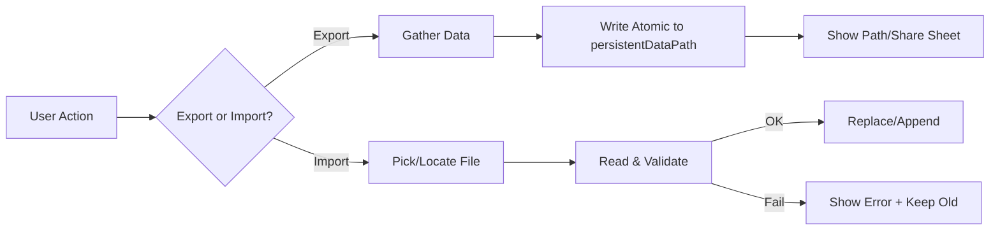

# 08 — داده و ذخیره‌سازی آفلاین (JSON + مسیرهای محلی)
> این فصل یک راهنمای عملی برای مدیریت دادهٔ سبک در اپ‌های Unity (به‌ویژه AR) است—**کاملاً عمومی**، بدون اشاره به دامنهٔ خاص. تمرکز بر رویکرد آفلاین‌محور، فایل‌های JSON، مسیرهای امن خواندن/نوشتن، نسخه‌بندی Schema، و خروجی/ورودی (Export/Import) است.

- **چکیده:** برای یک MVP سبک، **JSON + `Application.persistentDataPath`** معمولاً کافی و ساده است. فایل‌های نمونه را می‌توان از `StreamingAssets/` کپی کرد و در اجرا تغییر داد. برای دوام و پایداری، نسخهٔ Schema، اعتبارسنجی، نوشتن اتمیک و لاگ حداقلی را اضافه کنید.
- **پس از مطالعه:** می‌توانید ساختار JSON تعریف کنید، آن را بخوانید/بنویسید، بین `StreamingAssets` و `persistentDataPath` پل بزنید، و Export/Import ارائه دهید.

---

## 1) انتخاب رسانهٔ ذخیره‌سازی: مقایسهٔ سریع
| گزینه | مزایا | معایب | مناسب برای |
|---|---|---|---|
| **JSON در فایل** | ساده، انسانی‌خوانا، بدون وابستگی | سرعت/پرس‌وجو محدود، فساد احتمالی با نوشتن نادرست | پیکربندی، دادهٔ سبک، لاگ سبک |
| **ScriptableObject** | یکپارچه با Unity، سریع در Editor | نوشتن در اجرا دشوارتر، بافت توسعه‌محور | دادهٔ ثابت/نمونه‌ها |
| **SQLite** | کوئری قوی، تراکنش، دوام | پیچیدگی نصب/حجم/یادگیری | دادهٔ حجیم/ساختاریافته |
| **کلود** | همگام‌سازی، دسترسی همه‌جا | نیاز به اینترنت/زیرساخت | فازهای بعدی (نه MVP آفلاین) |

> برای شروع، JSON بهترین تعادل بین سادگی و کنترل است.

---

## 2) مسیرهای کلیدی ذخیره‌سازی در Unity
| مسیر | کاربرد | ویژگی |
|---|---|---|
| `Application.streamingAssetsPath` | فایل‌های *فقط‌خواندنی* بسته‌بندی‌شده با Build | روی Android داخل APK/AAB قرار می‌گیرد (نیاز به `UnityWebRequest`) |
| `Application.persistentDataPath` | مسیر **قابل‌نوشتن** و ماندگار | برای دادهٔ کاربر/تنظیمات/لاگ |
| (Editor) مسیر پروژه | فقط برای تست/نمونه‌ها | در Build وجود ندارد |

**الگوی کار:** دادهٔ اولیه در `StreamingAssets/` → *بارِ اول* کپی به `persistentDataPath` → از آن به بعد فقط با نسخهٔ قابل‌نوشتن کار کنید.

---

## 3) ساختاردهی فایل‌ها (نمونهٔ عمومی)
```
StreamingAssets/
  samples/
    objects.json
    config.json
    strings.fa.json
persistentData/
  objects.json
  config.json
  session_log.json
```

نمونهٔ **objects.json** (عمومی):
```json
[
  {"id":"OBJ-001","name":"Sample Box","width_mm":80,"height_mm":120,"depth_mm":50},
  {"id":"OBJ-002","name":"Sample Marker","width_mm":40,"height_mm":40,"depth_mm":2}
]
```

نمونهٔ **config.json**:
```json
{
  "schema_version": 1,
  "locale": "fa",
  "units": {"world_unit":"meter","data_unit":"millimeter"},
  "features": {"show_planes": true, "light_estimation": false}
}
```

لاگ سبک **session_log.json** (آرایهٔ رخدادها):
```json
[
  {"id":"e-001","ts":"2025-01-01T10:00:00Z","type":"info","msg":"app_start","meta":{}},
  {"id":"e-002","ts":"2025-01-01T10:01:30Z","type":"warn","msg":"low_light","meta":{"lux":20}}
]
```

---

## 4) کلاس‌های داده (C#) — ساده و سریال‌پذیر
```csharp
[System.Serializable]
public class ObjDef {
  public string id;
  public string name;
  public int width_mm, height_mm, depth_mm;
}

[System.Serializable]
public class AppConfig {
  public int schema_version;
  public string locale;
  public Units units;
  public Features features;
}

[System.Serializable] public class Units { public string world_unit; public string data_unit; }
[System.Serializable] public class Features { public bool show_planes; public bool light_estimation; }
```

> می‌توانید از **JsonUtility** (سبک اما محدود) یا **Newtonsoft.Json** (انعطاف‌پذیرتر) استفاده کنید.

---

## 5) سرویس دادهٔ عمومی: خواندن/نوشتن امن
### 5.1 نسخهٔ مبتنی بر Newtonsoft.Json (انعطاف بیشتر)
```csharp
using System.IO;
using System.Collections.Generic;
using UnityEngine;
using Newtonsoft.Json;
using UnityEngine.Networking;
using System.Collections;

public static class DataService
{
    public static string PersistentPath => Application.persistentDataPath;

    // خواندن متن از مسیر (StreamingAssets روی Android با UWR)
    public static IEnumerator ReadText(string path, System.Action<string> onDone, System.Action<string> onError)
    {
#if UNITY_ANDROID && !UNITY_EDITOR
        if (path.StartsWith(Application.streamingAssetsPath))
        {
            using var req = UnityWebRequest.Get(path);
            yield return req.SendWebRequest();
            if (req.result != UnityWebRequest.Result.Success) onError?.Invoke(req.error);
            else onDone?.Invoke(req.downloadHandler.text);
            yield break;
        }
#endif
        try { onDone?.Invoke(File.ReadAllText(path)); }
        catch (System.Exception ex) { onError?.Invoke(ex.Message); }
        yield break;
    }

    public static T FromJson<T>(string json) => JsonConvert.DeserializeObject<T>(json);
    public static string ToJson(object obj) => JsonConvert.SerializeObject(obj, Formatting.Indented);

    // نوشتن اتمیک: ابتدا tmp سپس Replace
    public static void WriteAtomic(string fullPath, string content)
    {
        var dir = Path.GetDirectoryName(fullPath);
        if (!Directory.Exists(dir)) Directory.CreateDirectory(dir);
        var tmp = fullPath + ".tmp";
        File.WriteAllText(tmp, content);
        if (File.Exists(fullPath)) File.Replace(tmp, fullPath, null);
        else File.Move(tmp, fullPath);
    }
}
```

### 5.2 نسخهٔ سبک با `JsonUtility` (بدون Newtonsoft)
```csharp
public static class JsonLite
{
    public static T Load<T>(string fullPath)
    {
        var json = System.IO.File.ReadAllText(fullPath);
        return JsonUtility.FromJson<T>(json);
    }
    public static void Save<T>(string fullPath, T obj)
    {
        var json = JsonUtility.ToJson(obj, true);
        System.IO.File.WriteAllText(fullPath, json);
    }
}
```
> **JsonUtility** فقط کلاس‌های ساده را پشتیبانی می‌کند (نه Dictionary/لیست تو در تو).

---

## 6) کپی نمونه‌ها از StreamingAssets → persistentDataPath (بار اول)
```csharp
using UnityEngine;
using System.Collections;
using System.IO;

public class BootstrapCopy : MonoBehaviour
{
    public string[] sampleFiles = { "samples/objects.json", "samples/config.json" };

    IEnumerator Start()
    {
        foreach (var rel in sampleFiles)
        {
            var src = System.IO.Path.Combine(Application.streamingAssetsPath, rel);
            var dst = System.IO.Path.Combine(Application.persistentDataPath, Path.GetFileName(rel));
            if (File.Exists(dst)) continue;

            string text = null; string err = null;
            yield return DataService.ReadText(src, s => text = s, e => err = e);
            if (err != null) { Debug.LogError(err); continue; }
            DataService.WriteAtomic(dst, text);
        }
        Debug.Log("Bootstrap copy finished.");
    }
}
```

> این الگو تضمین می‌کند فایل‌های نمونه به محل **قابل‌نوشتن** منتقل شوند و بعداً بتوانید آن‌ها را تغییر دهید.

---

## 7) نسخه‌گذاری Schema و مهاجرت
در هر فایل **schema_version** نگه دارید. هنگام بارگذاری:
```csharp
int SUPPORTED = 1;
var cfg = DataService.FromJson<AppConfig>(json);
if (cfg.schema_version != SUPPORTED) {
  // مهاجرت: mapping ساده یا تبدیل‌های موردی
  // مثال: تغییر نام فیلد، افزودن مقدار پیش‌فرض
}
```
**قواعد:**  
- **Backward compatible** تا حد ممکن.  
- فیلدهای جدید با **مقدار پیش‌فرض** اضافه شوند.  
- تغییرات شکاف‌دار را با **مبدل مهاجرتی** اعمال کنید.

---

## 8) اعتبارسنجی ورودی و مدیریت خطا
- قبل از قبول داده، نوع/رنج/اجبار فیلدها را بررسی کنید.
- در صورت خطا: پیام خوانا + ورود رخداد در لاگ.
- از **Try/Catch** در مرزهای I/O استفاده کنید؛ در منطق دامنه از الگوهای *Result/Option* یا Exception کم‌تواتر بهره ببرید.

نمونهٔ اعتبارسنجی کوچک (C#):
```csharp
bool ValidateObjects(List<ObjDef> list, out string reason) {
  if (list == null || list.Count == 0) { reason = "لیست خالی است"; return false; }
  foreach (var o in list) {
    if (string.IsNullOrWhiteSpace(o.id)) { reason = "شناسه خالی"; return false; }
    if (o.width_mm <= 0 || o.height_mm <= 0 || o.depth_mm <= 0) { reason = "ابعاد نامعتبر"; return false; }
  }
  reason = null; return true;
}
```

---

## 9) Export / Import (JSON/CSV)
### 9.1 Export
- یک دکمهٔ ساده برای خروجی گرفتن از داده/لاگ به JSON/CSV در `persistentDataPath`.
- **نام‌گذاری فایل** با timestamp: `export-YYYYMMDD-HHMMSS.json`

```csharp
public static class Exporter {
  public static string ExportJson(object data, string prefix="export") {
    var name = $"{prefix}-{System.DateTime.UtcNow:yyyyMMdd-HHmmss}.json";
    var path = System.IO.Path.Combine(Application.persistentDataPath, name);
    DataService.WriteAtomic(path, DataService.ToJson(data));
    return path;
  }
}
```

### 9.2 Import
- در موبایل، انتخاب فایل نیازمند پل‌های بومی/Plug-in است؛ برای MVP می‌توانید Import را از مسیر ثابت یا کپی دستی به `persistentDataPath` انجام دهید.
- حتماً **اعتبارسنجی** کنید و نسخهٔ Schema را بررسی کنید.

**فلو Import/Export (Mermaid):**


---

## 10) نکات عملکرد/پایداری
- در نوشتن روی دیسک **Throttle** رعایت کنید (تجمع و نوشتن دوره‌ای).
- برای فایل‌های بزرگ از **GZip** ساده استفاده کنید (در صورت نیاز).
- عملیات I/O را روی **Thread** یا **Coroutine** انجام دهید تا UI فریز نشود.
- در اندروید، نوشتن در حافظهٔ خارجی حساس است؛ ترجیحاً در `persistentDataPath` بمانید.

---

## 11) امنیت و حریم خصوصی (حداقلی)
- **حداقل دادهٔ شخصی** را ذخیره کنید؛ اگر لازم شد، **ناشناس‌سازی** کنید.
- مسیر و مکان فایل‌ها را در UI به‌صورت شفاف نشان دهید.
- برای دادهٔ حساس: رمزنگاری سمت‌کاربر (**AES** با کلید محلی/مشتق‌شده) را در نظر بگیرید—اما پیچیدگی را بسنجید.
- برای اشتراک فایل، از Share Sheet سیستم‌عامل استفاده کنید و هشدار دهید که حاوی اطلاعات محلی است.

---

## 12) i18n و پیکربندی‌ها
- رشته‌ها را در فایل‌های زبان جدا نگه دارید (`strings.fa.json`, `strings.en.json`).
- `config.json` برای پرچم ویژگی‌ها/تنظیمات؛ تغییرات را **اتمیک** ذخیره کنید.
- برای RTL: `dir: "rtl"` در فایل زبان و یک لایهٔ واسط برای اعمال جهت‌گیری UI.

نمونهٔ `strings.fa.json`:
```json
{"lang":"fa","dir":"rtl","strings":{"ok":"باشه","cancel":"انصراف","move_device":"دستگاه را آرام حرکت دهید."}}
```

---

## 13) الگوی Repository (اختیاری، تمیزتر)
```csharp
public interface IObjectsRepo {
  List<ObjDef> All { get; }
  void SaveAll(List<ObjDef> list);
}

public class JsonObjectsRepo : IObjectsRepo {
  string path;
  public JsonObjectsRepo(string fullPath) { path = fullPath; }
  public List<ObjDef> All => JsonConvert.DeserializeObject<List<ObjDef>>(File.ReadAllText(path));
  public void SaveAll(List<ObjDef> list) => DataService.WriteAtomic(path, JsonConvert.SerializeObject(list, Formatting.Indented));
}
```
> این لایه جداسازی تست/تعویض منبع داده را آسان می‌کند.

---

## 14) چک‌لیست پیاده‌سازی
- [ ] نمونه‌ها در `StreamingAssets/` قرار دارند.
- [ ] Bootstrap کپی به `persistentDataPath` در بار اول.
- [ ] Loader/Writer با نوشتن اتمیک و Validation.
- [ ] Schema version و مسیر مهاجرت.
- [ ] Export/Import با پیام‌های روشن و مسیر فایل.
- [ ] I/O غیرمسدودکننده (Coroutine/Thread) و خطاهای ثبت‌شده.

---

## 15) نکات کلیدی فصل
- برای MVP، **JSON + persistentDataPath** سریع و کافی است.
- **StreamingAssets → persistentDataPath**: الگوی طلایی برای فایل‌های نمونه/پیش‌فرض.
- **نوشتن اتمیک، نسخه‌بندی Schema و اعتبارسنجی** از فساد داده جلوگیری می‌کند.
- از **I/O غیرمسدودکننده** و **ثبت رخدادها** برای عیب‌یابی بهره بگیرید.
- Export/Import را ساده و شفاف نگه دارید؛ همیشه نسخهٔ پشتیبان بگیرید.
