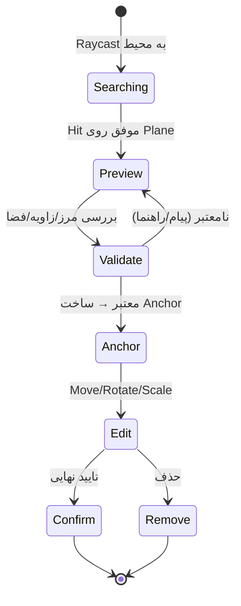

# 11 — اصول جای‌گذاری اشیا در AR (Placement & Alignment)
> این فصل الگوها و تکنیک‌های عملی برای **یافتن محل مناسب، اعتبارسنجی، هم‌تراز کردن، Anchor کردن، جابه‌جایی، و جلوگیری از تداخل** را پوشش می‌دهد—به‌صورت کاملاً عمومی و مستقل از هر اپ خاص.

- **چکیده:** الگوی طلایی در موبایل: **Raycast → Preview → Validate → Anchor → Edit/Confirm**. بر پایهٔ Planeها و Anchorهای پایدار عمل کنید، دوران/مقیاس را محدود کنید، و با قوانین سادهٔ فاصله/مرز از تداخل جلوگیری کنید.
- **پس از مطالعه:** می‌توانید یک کنترلر جای‌گذاری بسازید که اشیا را با اسنپ (Grid/Angle)، بررسی مرز Plane، رعایت فاصلهٔ ایمن و امکان جابه‌جایی/حذف مدیریت کند.

---

## 1) فلو استاندارد جای‌گذاری


**قواعد ذهنی**
- همه‌چیز از **مرکز صفحه یا نقطهٔ لمس** Raycast می‌شود.
- تا زمانی که **تأیید** نشده، شیء در **حالت Preview** است (رنگ/Outline متفاوت).
- پس از تأیید، **Anchor** می‌سازید و شیء را به آن متصل می‌کنید.

---

## 2) Raycast: انتخاب Hit مناسب
```csharp
using System.Collections.Generic;
using UnityEngine;
using UnityEngine.XR.ARFoundation;
using UnityEngine.XR.ARSubsystems;

public static class ARHits
{
    static readonly List<ARRaycastHit> hits = new();

    public static bool TryGetHit(ARRaycastManager rm, Vector2 screenPt,
                                 out Pose pose, out ARPlane plane)
    {
        pose = default; plane = null;
        if (!rm.Raycast(screenPt, hits, TrackableType.PlaneWithinPolygon))
            return false;

        // نزدیک‌ترین برخورد
        var h = hits[0];
        pose = h.pose;
        plane = h.trackable as ARPlane;
        return plane != null;
    }
}
```
**نکات:**
- نوع Trackable را **PlaneWithinPolygon** بگذارید تا داخل مرز Plane بیفتد.
- برای تجربهٔ ساده، از **مرکز صفحه** به‌صورت پیوسته Raycast کنید و Reticle نشان دهید.

---

## 3) هم‌ترازی (Alignment) و چرخش
### 3.1 اصول
- روی **Plane افقی**: شیء را قائم نگه دارید (Up = World Up)، فقط **Yaw** بچرخانید.
- روی **Plane عمودی**: نرمال Plane، جهت «پشت» شیء را تعیین می‌کند. Up را **World Up** نگه دارید تا وارونه نشود.

```csharp
public static class PlacementPose
{
    public static void AlignToPlane(ref Pose pose, ARPlane plane, Transform cameraTf)
    {
        var n = plane.normal; // نرمال Plane (جهت عمود بر سطح)
        if (Vector3.Dot(n, Vector3.up) > 0.75f) // تقریباً افقی رو به بالا
        {
            // yaw بر اساس جهت دوربین
            var fwd = Vector3.ProjectOnPlane(cameraTf.forward, Vector3.up).normalized;
            pose.rotation = Quaternion.LookRotation(fwd, Vector3.up);
        }
        else
        {
            // عمودی: جلو به سمت دوربین، نرمال را به عنوان محور عمود لحاظ کن
            var fwd = -plane.normal;
            if (Vector3.Dot(fwd, cameraTf.forward) < 0) fwd = -fwd;
            pose.rotation = Quaternion.LookRotation(fwd, Vector3.up);
        }
    }
}
```

### 3.2 اسنپ زاویه‌ای و شبکه‌ای
```csharp
public static class SnapUtil
{
    public static Quaternion SnapYaw(Quaternion rot, float stepDeg = 15f)
    {
        var e = rot.eulerAngles;
        e.y = Mathf.Round(e.y / stepDeg) * stepDeg;
        return Quaternion.Euler(e);
    }

    public static Vector3 SnapGrid(Vector3 pos, float gridM = 0.05f)
    {
        return new Vector3(
            Mathf.Round(pos.x / gridM) * gridM,
            pos.y,
            Mathf.Round(pos.z / gridM) * gridM);
    }
}
```


---

## 4) مرز Plane و حاشیهٔ ایمن
- بهتر است شیء **داخل چند سانتی‌متر از مرز Plane** قرار نگیرد (برای پایداری و زیبایی).
- از مرز چندضلعی Plane استفاده کنید: `ARPlane.boundary` (آرایهٔ نقاط 2D محلی).

**بررسی «داخل/خارج» + فاصله از مرز:**
```csharp
using System.Linq;

public static class PlaneBoundaryUtil
{
    // تبدیل نقطهٔ جهانی به مختصات محلی Plane
    static Vector2 WorldToPlaneLocal(ARPlane p, Vector3 worldPos)
    {
        var local = p.transform.InverseTransformPoint(worldPos);
        return new Vector2(local.x, local.z);
    }

    // تست نقطه در چندضلعی (even-odd rule)
    public static bool IsInside(ARPlane p, Vector3 worldPos)
    {
        var pt = WorldToPlaneLocal(p, worldPos);
        var poly = p.boundary; // NativeArray<Vector2>
        bool inside = false;
        for (int i = 0, j = poly.Length - 1; i < poly.Length; j = i++)
        {
            var pi = poly[i]; var pj = poly[j];
            bool intersect = ((pi.y > pt.y) != (pj.y > pt.y)) &&
                             (pt.x < (pj.x - pi.x) * (pt.y - pi.y) / (pj.y - pi.y) + pi.x);
            if (intersect) inside = !inside;
        }
        return inside;
    }

    // فاصلهٔ تقریبی از نزدیک‌ترین یال چندضلعی
    public static float DistanceToEdge(ARPlane p, Vector3 worldPos)
    {
        var pt = WorldToPlaneLocal(p, worldPos);
        var poly = p.boundary;
        float min = float.MaxValue;
        for (int i = 0, j = poly.Length - 1; i < poly.Length; j = i++)
        {
            var a = poly[j]; var b = poly[i];
            var ab = b - a;
            var t = Mathf.Clamp01(Vector2.Dot(pt - a, ab) / Vector2.Dot(ab, ab));
            var proj = a + t * ab;
            min = Mathf.Min(min, Vector2.Distance(pt, proj));
        }
        return min;
    }
}
```
**قاعدهٔ ساده:** اگر `!IsInside(...)` یا `DistanceToEdge(...) < marginM` → نامعتبر.

---

## 5) ساخت Anchor و مدیریت تغییرات Plane
```csharp
public class AnchorService : MonoBehaviour
{
    public ARAnchorManager anchorManager;
    public ARPlaneManager planeManager;

    public ARAnchor AttachToPlane(ARPlane plane, Pose pose)
    {
        return anchorManager.AttachAnchor(plane, pose);
    }

    void OnEnable() => planeManager.planesChanged += OnPlanesChanged;
    void OnDisable() => planeManager.planesChanged -= OnPlanesChanged;

    void OnPlanesChanged(ARPlanesChangedEventArgs args)
    {
        // اگر Plane منبع Anchor "Merged/Subsumed" شد، Anchorها را دوباره متصل کنید
        foreach (var updated in args.updated)
        {
            if (updated.subsumedBy != null)
            {
                foreach (var a in updated.GetComponentsInChildren<ARAnchor>())
                {
                    var newA = anchorManager.AttachAnchor(updated.subsumedBy, new Pose(a.transform.position, a.transform.rotation));
                    if (newA) { a.transform.SetParent(newA.transform, true); Destroy(a); }
                }
            }
        }
    }
}
```
**نکته:** جابه‌جایی Anchor در زمان طولانی، پایداری را بالا می‌برد.

---

## 6) حالت‌های حرکت/چرخش/مقیاس (Edit Mode)
```csharp
public class GizmoMover : MonoBehaviour
{
    public ARRaycastManager raycastManager;
    public Camera cam;
    public ARPlane plane;
    public Transform target; // شیء متصل به Anchor

    bool _drag;
    void Update()
    {
        if (Input.touchCount == 0) return;
        var t = Input.GetTouch(0);
        if (t.phase == TouchPhase.Began) _drag = true;
        if (_drag && (t.phase == TouchPhase.Moved || t.phase == TouchPhase.Stationary))
        {
            if (ARHits.TryGetHit(raycastManager, t.position, out var pose, out var p) && p == plane)
            {
                target.position = pose.position; // در حرکت، Anchor را بعداً جابه‌جا/بازبسازید
            }
        }
        if (t.phase == TouchPhase.Ended) _drag = false;
    }
}
```
**بهبود:** پس از پایان Drag، **Anchor جدید** بسازید و شیء را به آن منتقل کنید؛ Anchor قبلی را حذف کنید (برای جلوگیری از انباشت).

### 6.1 Pinch/Rotate (حداقل/حداکثر)
```csharp
public class PinchRotate : MonoBehaviour
{
    public Transform target;
    public float minScale = 0.5f, maxScale = 2.0f;

    void Update()
    {
        if (Input.touchCount == 2)
        {
            var t0 = Input.touches[0];
            var t1 = Input.touches[1];
            var prev = (t0.position - t0.deltaPosition) - (t1.position - t1.deltaPosition);
            var curr = t0.position - t1.position;
            float prevDist = prev.magnitude;
            float currDist = curr.magnitude;

            // Scale
            float s = target.localScale.x * (currDist / Mathf.Max(1f, prevDist));
            s = Mathf.Clamp(s, minScale, maxScale);
            target.localScale = new Vector3(s, s, s);

            // Rotate (زاویه بین دو بردار)
            float ang = Vector2.SignedAngle(prev, curr);
            target.Rotate(Vector3.up, ang, Space.World);
        }
    }
}
```

---

## 7) جلوگیری از تداخل و رعایت فاصلهٔ ایمن
### 7.1 برخورد ساده با OverlapBox
- به هر شیء **BoxCollider** بدهید.
- قبل از تایید/جابجایی، یک **OverlapBox** بگیرید و اگر با دیگری هم‌پوشانی داشت، نامعتبر کنید.

```csharp
using System.Linq;
public static class PlacementRules
{
    public static bool IsFree(Transform t, Vector3 halfExtents, LayerMask mask, float minClearanceM)
    {
        var hits = Physics.OverlapBox(t.position, halfExtents + Vector3.one * minClearanceM, t.rotation, mask);
        // خود شیء را نادیده بگیرید
        return !hits.Any(h => h.transform != t && h.transform.root != t);
    }
}
```
**توجه:** دقت برخورد فیزیکی به هم‌ترازی Colliders و Pivot بستگی دارد. برای عملکرد، **Layer**ها را محدود کنید.

### 7.2 قواعد نرم/سخت
- **Hard Constraint**: ممنوعیت مطلق (خارج از مرز، برخورد). → قرمز/عدم تأیید.
- **Soft Constraint**: توصیه (فاصلهٔ پیشنهادی، زاویهٔ مطلوب). → زرد/هشدار.

---

## 8) کنترل خطا و راهنمایی کاربر
| نشانه | پیام کوتاه | اقدام |
|---|---|---|
| خارج از مرز Plane | «خارج از سطح شناسایی‌شده» | به داخل سطح حرکت دهید |
| نزدیک به لبه | «خیلی نزدیک به لبه» | کمی فاصله بگیرید |
| زاویه نامناسب | «زاویهٔ سطح مناسب نیست» | زاویه را اصلاح کنید |
| هم‌پوشانی با شیء دیگر | «تداخل با شیء مجاور» | جابه‌جا کنید |
| Anchor از دست رفت | «بازکشف سطح…» | چند لحظه دستگاه را آرام حرکت دهید |

> پیام‌ها باید **کوتاه، عملی و بی‌ابهام** باشند؛ از آیکون رنگی برای حالت‌ها استفاده کنید.

---

## 9) عملکرد و پایداری
- Raycast را **Throttled** کنید (مثلاً هر 2–3 فریم)؛ مگر در حالت Drag که پیوسته لازم است.
- از **Pooling** برای اشیا/Outline/Reticle استفاده کنید.
- Visualization Plane/Points را در حالت Preview فعال و پس از تأیید غیرفعال کنید.
- برای محاسبات مرز (Polygon)، از **کَش** استفاده کنید و در به‌روزرسانی‌های Plane بازسازی کنید.

---

## 10) ساخت «کنترلر جای‌گذاری» ماژولار (نمونهٔ ساختار)
```
PlacementController (Coordinator)
 ├─ ReticleController         (Raycast مرکز صفحه + نمایش)
 ├─ Validator                 (مرز، فاصلهٔ لبه، برخورد، قواعد نرم/سخت)
 ├─ PoseAligner               (افقی/عمودی، Snap زاویه/شبکه)
 ├─ AnchorService             (Attach/Detach/Plane merge handling)
 ├─ EditGizmos                (Move/Rotate/Scale + محدودیت‌ها)
 └─ UIHints                   (پیام‌ها/رنگ حالت‌ها)
```
- هر مولفه **قابل‌تعویض** باشد؛ تست واحد آسان‌تر می‌شود.

---

## 11) چک‌لیست پیاده‌سازی
- [ ] Reticle با Raycast پیوسته در مرکز صفحه.
- [ ] Preview با رنگ/Outline متمایز.
- [ ] Align افقی/عمودی + Snap زاویه/شبکه اختیاری.
- [ ] اعتبارسنجی: داخل مرز Plane + حاشیهٔ ایمن.
- [ ] Anchor پس از تأیید و بازاتصال در ادغام Plane.
- [ ] Edit Mode: Drag/Pinch/Rotate با محدودیت‌های حداقل/حداکثر.
- [ ] عدم تداخل: OverlapBox/قواعد فاصله.
- [ ] پیام‌های کوتاه و عملی برای خطا/هشدار.
- [ ] بهینه‌سازی Raycast/Pooling/Visualization.
- [ ] تست روی چند دستگاه/محیط با نور/بافت متفاوت.

---

## 12) نکات کلیدی فصل
- **Raycast → Preview → Validate → Anchor** را به‌صورت شفاف به کاربر نشان دهید؛ ابهام UX را کاهش می‌دهد.
- هم‌ترازی **افقی/عمودی** و **Snap** زاویه‌ای تفاوت بزرگی در «تمیزی» نتیجه ایجاد می‌کند.
- با **قواعد سادهٔ مرز و فاصله** می‌توان از بسیاری از خطاهای رایج جلوگیری کرد.
- پایداری بلندمدت وابسته به **Anchorهای درست** و واکنش به تغییرات Plane است.
