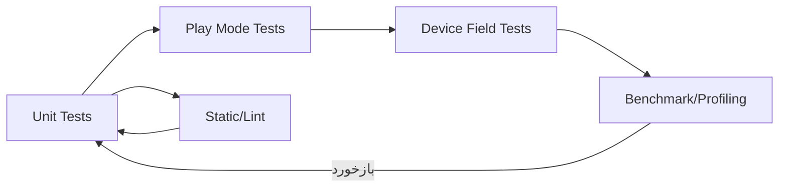

# 12 — تست، لاگ و معیارهای پذیرش (برای AR عمومی)
> این فصل رویکردی عملی برای **تست کاربردی/کارایی/پایداری**، طراحی **لاگ سبک و قابل‌تحلیل**، و تعریف **Acceptance Criteria** برای یک MVP AR ارائه می‌دهد—بدون وابستگی به اپ خاص.

- **چکیده:** بخش‌های زمان‌حساس/وابسته به حسگر را با تست میدانی روی دستگاه ارزیابی کنید و منطق‌های قابل‌جداسازی (Placement/Validation/Scale) را با **تست واحد** بپوشانید. لاگ‌ها را به‌صورت **JSON/CSV** و اتمیک ذخیره کنید. برای پذیرش MVP، معیارهای **پایداری Tracking، دقت مقیاس، FPS، و UX قابل‌خواندن** را تعریف کنید.
- **پس از مطالعه:** می‌توانید یک برنامهٔ تست بنویسید، Unit Test راه بیندازید، یک Event Logger سبک بسازید و خروجی‌های قابل‌تحلیل تحویل دهید.

---

## 1) نقشهٔ کلی تست‌ها

- **Unit Tests:** منطق‌های خالص (Placement Validator, Snap, Scale).
- **Play Mode Tests:** تعامل‌های ساده در Editor با Mock/Stub.
- **Device Field Tests:** روی موبایل واقعی در محیط‌های مختلف.
- **Benchmark/Profiling:** FPS/GC/Memory/CPU/GPU.
- **Static/Lint:** کیفیت کد (نام‌گذاری/وابستگی/Dead Code).

---

## 2) ماتریس تست دستگاه و محیط
| بُعد | تنوع پیشنهادی |
|---|---|
| دستگاه | حداقل یک میان‌رده Android + یک پرچم‌دار (اختیاری iOS) |
| نور | کم، متوسط، زیاد (بدون ضدنور مستقیم) |
| بافت | سطح مات با بافت، سطح یکنواخت، سطوح براق/شفاف (برای مشاهده خطا) |
| فضا | اتاق کوچک، فضای بازتر |
| حرکات | آرام، چرخش سریع، جابه‌جایی چندگانه |

> نتیجهٔ هر سناریو را در یک فرم کوتاه ثبت کنید (زمان، خطا، احساس کاربر، لاگ‌های فنی).

---

## 3) Acceptance Criteria (نمونهٔ عمومی برای MVP)
- **اجرای پایه:** اپ اجرا و مجوز دوربین اخذ شود؛ کرش نداشته باشد.
- **کشف سطح:** Planeهای افقی/عمودی (حداقل افقی) به‌صورت پایدار نمایش داده شوند.
- **Reticle:** نشانک مرکز صفحه وضعیت «قابل/غیرقابل» را نشان دهد.
- **Placement:** Tap → قراردهی پایدار روی Plane + ساخت Anchor.
- **Alignment:** چرخش/مقیاس با ژست‌ها کار کند (با محدودیت‌های منطقی).
- **Calibration (اختیاری اما توصیه‌شده):** نسبت mm↔m محاسبه و اعمال شود؛ خطای نسبی ≤ 3% در آزمون صحت.
- **UX و RTL:** متن‌ها و دکمه‌ها خوانا؛ RTL (در صورت نیاز) صحیح.
- **Performance:** FPS متوسط ≥ 30 روی دستگاه میان‌رده؛ بدون جهش‌های GC محسوس.
- **Logging:** رویدادهای کلیدی ثبت و **Export JSON/CSV** ممکن باشد.
- **آفلاین:** تجربه بدون اینترنت کامل باشد.

چک‌لیست کوتاه قبول:
- [ ] بدون کرش در 15 دقیقه استفادهٔ پیوسته  
- [ ] FPS ≥ 30 (میانگین) / ≥ 24 (کمینهٔ 1% بدترین فریم‌ها)  
- [ ] دقت مقیاس ≤ 3% (در صورت فعال بودن کالیبراسیون)  
- [ ] UX خوانا در نور کم/زیاد  
- [ ] لاگ‌ها قابل Export و معتبرند  

---

## 4) طراحی سیستم لاگ سبک
### 4.1 Schema پیشنهادی (عمومی)
```json
{
  "event_id": "uuid",
  "ts": "2025-09-14T10:15:30Z",
  "type": "info|warn|error",
  "category": "session|tracking|placement|ui|calibration|performance",
  "action": "start|stop|tap|place|move|rotate|scale|confirm|cancel",
  "duration_ms": 0,
  "meta": {"key":"value"}
}
```
- **ts**: ISO-8601 UTC.  
- **duration_ms**: برای عملیات‌های قابل‌اندازه‌گیری (Placement/Calibration).  
- **meta**: کلید-مقدار آزاد (بدون دادهٔ شخصی).

### 4.2 کلاس‌های C# (ساده و سریال‌پذیر)
```csharp
using System;
using System.Collections.Generic;
using UnityEngine;

[Serializable]
public class EventLogItem {
  public string event_id;
  public string ts;
  public string type;     // info|warn|error
  public string category; // session|tracking|placement|ui|calibration|performance
  public string action;   // start|stop|tap|place|move|...
  public int duration_ms;
  public Dictionary<string, object> meta;
}

[Serializable]
public class EventLog {
  public List<EventLogItem> items = new();
}
```

### 4.3 Logger سبک با بافر و نوشتن اتمیک
```csharp
using System.IO;
using System.Text;
using System.Linq;
using Newtonsoft.Json;
using UnityEngine;

public class LiteLogger : MonoBehaviour
{
    public string fileNameJson = "event_log.json";
    public string fileNameCsv = "event_log.csv";
    public int flushEach = 10;        // هر N رویداد فلش شود
    public float flushInterval = 5f;  // حداکثر هر 5 ثانیه

    EventLog buffer = new();
    float _t;
    string JsonPath => Path.Combine(Application.persistentDataPath, fileNameJson);
    string CsvPath  => Path.Combine(Application.persistentDataPath, fileNameCsv);

    void Update()
    {
        _t += Time.unscaledDeltaTime;
        if (_t >= flushInterval) Flush();
    }

    public void Log(EventLogItem e)
    {
        buffer.items.Add(e);
        if (buffer.items.Count % flushEach == 0) Flush();
    }

    public void Flush()
    {
        if (buffer.items.Count == 0) { _t = 0; return; }
        try
        {
            // JSON اتمیک
            var json = JsonConvert.SerializeObject(buffer.items, Formatting.Indented);
            WriteAtomic(JsonPath, json);

            // CSV افزایشی (append)
            AppendCsv(buffer.items);
            buffer.items.Clear();
        }
        catch (System.Exception ex) { Debug.LogError(ex.Message); }
        finally { _t = 0; }
    }

    static void WriteAtomic(string fullPath, string content)
    {
        var dir = Path.GetDirectoryName(fullPath);
        if (!Directory.Exists(dir)) Directory.CreateDirectory(dir);
        var tmp = fullPath + ".tmp";
        File.WriteAllText(tmp, content, Encoding.UTF8);
        if (File.Exists(fullPath)) File.Replace(tmp, fullPath, null);
        else File.Move(tmp, fullPath);
    }

    void AppendCsv(List<EventLogItem> items)
    {
        var sb = new StringBuilder();
        if (!File.Exists(CsvPath))
            sb.AppendLine("event_id,ts,type,category,action,duration_ms,meta_json");
        foreach (var it in items)
        {
            var meta = JsonConvert.SerializeObject(it.meta ?? new System.Collections.Generic.Dictionary<string, object>());
            sb.AppendLine($"{it.event_id},{it.ts},{it.type},{it.category},{it.action},{it.duration_ms},"{meta.Replace(""","""")}"");
        }
        File.AppendAllText(CsvPath, sb.ToString(), Encoding.UTF8);
    }
}
```
> **حریم خصوصی:** در `meta` از ذخیرهٔ چهره/مکان دقیق/اطلاعات شخصی خودداری کنید.

### 4.4 ساخت رویداد
```csharp
using System;
using UnityEngine;

public static class Ev
{
    public static EventLogItem Make(string type, string category, string action, int durMs = 0, System.Collections.Generic.Dictionary<string, object> meta = null)
    {
        return new EventLogItem {
            event_id = Guid.NewGuid().ToString(),
            ts = DateTime.UtcNow.ToString("o"),
            type = type,
            category = category,
            action = action,
            duration_ms = durMs,
            meta = meta ?? new()
        };
    }
}
```
نمونه:
```csharp
// شروع نشست
logger.Log(Ev.Make("info","session","start"));
// ثبت یک Placement
logger.Log(Ev.Make("info","placement","place", durMs: 320, meta: new(){ ["plane"]="horizontal", ["snap"]="15deg" }));
```

---

## 5) Export/Import لاگ‌ها
- **Export**: مسیر فایل JSON/CSV را نمایش دهید؛ از Share Sheet سیستم‌عامل استفاده کنید.
- **Import** (اختیاری): ادغام چند لاگ برای تحلیل یک‌جا.  
- روی Desktop می‌توانید با Python/Excel/Notebook نمودار بکشید.

نمونهٔ CSV:
```csv
event_id,ts,type,category,action,duration_ms,meta_json
1f..,2025-09-14T10:00:00Z,info,session,start,0,"{}"
2a..,2025-09-14T10:01:02Z,info,placement,place,320,"{""plane"":""horizontal"",""snap"":""15deg""}"
```

---

## 6) تست واحد (NUnit) برای منطق‌های خالص
### 6.1 Validator نمونه (خالص)
```csharp
public static class PlacementValidator
{
    public static bool IsAngleOk(float planeNormalDotUp, float minDot = 0.75f)
        => planeNormalDotUp >= minDot;

    public static bool IsInside(float distanceToEdgeM, float marginM = 0.03f)
        => distanceToEdgeM >= marginM;

    public static float SnapYawDeg(float yaw, float stepDeg = 15f)
        => Mathf.Round(yaw / stepDeg) * stepDeg;
}
```

### 6.2 تست‌ها با NUnit (EditMode/PlayMode)
```csharp
using NUnit.Framework;
using UnityEngine;

public class PlacementValidatorTests
{
    [Test]
    public void AngleOk_WhenDotHigh_ReturnsTrue()
    {
        Assert.IsTrue(PlacementValidator.IsAngleOk(0.9f));
    }

    [Test]
    public void Inside_WhenDistanceLessThanMargin_ReturnsFalse()
    {
        Assert.IsFalse(PlacementValidator.IsInside(0.01f, 0.03f));
    }

    [Test]
    public void SnapYawDeg_RoundsToNearestStep()
    {
        Assert.AreEqual(30f, PlacementValidator.SnapYawDeg(28f, 15f));
        Assert.AreEqual(45f, PlacementValidator.SnapYawDeg(44f, 15f));
    }
}
```
> این تست‌ها بدون وابستگی به AR اجرا می‌شوند و سریع‌اند.

---

## 7) Play Mode Tests و Mock کردن وابستگی‌ها
- مولفه‌های وابسته به AR را با **Interfaces** یا **Adapters** بپوشانید تا در Editor بتوانید ورودی‌های ساختگی به منطق بدهید.
- نمونه: `IRaycastProvider.TryRaycast(screenPt, out Pose, out PlaneData)` که در دستگاه واقعی به ARRaycastManager وصل است و در تست، شبیه‌ساز داده می‌دهد.

**نکته:** خروجی‌های تصادفی را با **Seed ثابت** یا مجموعهٔ دادهٔ بازپخش‌شده آزمایش کنید.

---

## 8) Device Field Tests (اسکریپت‌های زمان‌سنجی ساده)
```csharp
using System.Diagnostics;
using UnityEngine;

public class PerfProbe : MonoBehaviour
{
    public LiteLogger logger;
    Stopwatch sw = new();

    void Start()
    {
        Application.targetFrameRate = 60;
    }

    void Update()
    {
        // نمونه: هر 2 ثانیه FPS را ثبت کن
        _acc += Time.unscaledDeltaTime;
        _frames++;
        if (_acc >= 2f)
        {
            float fps = _frames / _acc;
            logger.Log(Ev.Make("info","performance","fps", meta: new(){ ["fps"]=fps }));
            _acc = 0; _frames = 0;
        }
    }

    float _acc; int _frames;
}
```
- با Unity Profiler/Android Logcat/Xcode همزمان مشاهده کنید: CPU, GPU, Rendering, GC.

---

## 9) پروفایلینگ: چه چیزی را باید بسنجیم؟
| محور | شاخص‌ها |
|---|---|
| FPS | میانگین، کمینه (1% worst)، نوسان |
| CPU/GPU | زمان رندر فریم، Draw Calls، Batches |
| Memory | پیک مصرف، **GC Alloc / Frame**، جهش‌های GC |
| I/O | دفعات Flush و مدت زمان هرکدام |
| Tracking | زمان کشف Plane، پایداری Anchor (کیفی) |
| UX | نرخ تکمیل وظیفه، خطاهای کاربر، NPS/CSAT (اختیاری) |

> هدف: شناسایی گلوگاه‌های سنگین (Transparency/Outline/Instantiate/Shader).

---

## 10) سناریوهای تست کاربردی (نمونهٔ عمومی)
1. **کشف سطح:** در سه محیط (کم/متوسط/زیاد نور)، زمان تا کشف Plane را ثبت کنید.  
2. **Placement/Anchor:** ۱۰ بار قراردهی مکرر؛ پایداری اشیا را با جابه‌جایی دوربین بررسی کنید.  
3. **مقیاس/چرخش:** Pinch/Rotate با محدودیت‌ها؛ رفتار در مرز Plane.  
4. **کالیبراسیون (در صورت وجود):** روش دو-نقطه؛ آزمون صحت با «مرجع دوم».  
5. **پایداری نشست طولانی:** ۱۵ دقیقه کار پیوسته؛ دما/Throttle/کاهش FPS را مشاهده کنید.  
6. **RTL و فونت:** نمایش صحیح متن، شکست خطوط، اعداد.  
7. **Export لاگ:** ایجاد/خواندن فایل‌ها، سازگاری JSON/CSV.

برای هر تست، **گام‌ها، معیار موفقیت، و ناهنجاری‌ها** را بنویسید.

---

## 11) مدیریت خطا و گزارش‌دادن
- روی خطاها **پیام‌های کوتاه و راه‌حل‌محور** نشان دهید.
- در لاگ با `type="error"` ثبت کنید و زمینهٔ لازم را در `meta` بگذارید (بدون دادهٔ حساس).
- اگر بخش مهمی شکست خورد (مثلاً عدم پشتیبانی AR)، **Fallback** یا پیام راهنما ارائه دهید.

---

## 12) حریم خصوصی و اخلاق
- فقط دادهٔ لازم را لاگ کنید؛ **اصل کمترین داده**.
- شناسه‌های تصادفی/جلسه‌ای استفاده کنید؛ از ذخیرهٔ اطلاعات شخصی بپرهیزید.
- مکان دقیق/تصویر اشخاص را ثبت نکنید مگر ضرورت و رضایت روشن.

---

## 13) چک‌لیست نهایی فصل
- [ ] برنامهٔ تست دستگاه/محیط آماده است.
- [ ] Unit Testهای منطق خالص نوشته و در CI/Editor سبز هستند.
- [ ] Play Mode Test برای تعامل‌های پایه آماده است.
- [ ] Event Logger سبک با نوشتن اتمیک/CSV/JSON پیاده‌سازی شد.
- [ ] پروفایلینگ FPS/GC/Memory انجام و گلوگاه‌ها اصلاح شدند.
- [ ] Acceptance Criteria تعریف و ارزیابی شد.
- [ ] اسناد تست/نتایج به‌روز و قابل ارائه است.

---

## 14) نکات کلیدی فصل
- **آنچه قابل جداسازی است، Unit Test شود؛ آنچه وابسته به حسگر است، در میدان تست شود.**
- **لاگ سبک و قابل‌تحلیل** از ابتدا ارزشمند است—برای اصلاحات بعدی حیاتی است.
- **FPS پایدار، مقیاس دقیق و UX خوانا** ستون‌های پذیرش یک MVP AR هستند.
