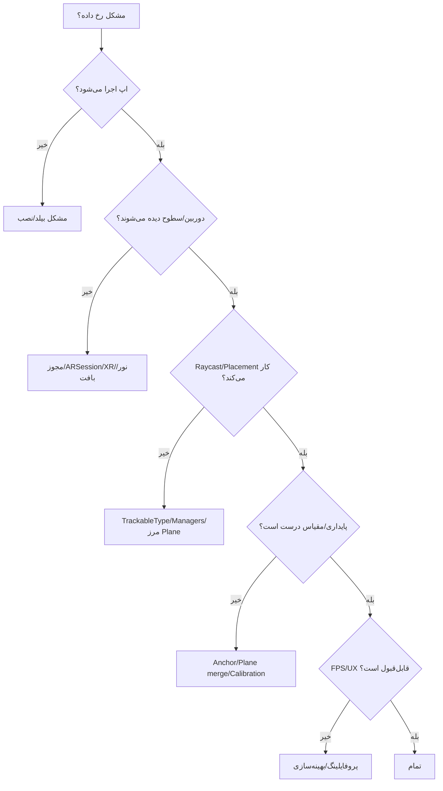

# 14 — عیب‌یابی و پرسش‌های پرتکرار (Troubleshooting & FAQ)
> این فصل یک **راهنمای عملی و سریع** برای حل مشکلات رایج در ساخت تجربه‌های AR با Unity + AR Foundation است—کاملاً **عمومی** و بدون ارجاع به اپ خاص. از خطاهای بیلد تا مشکلات ردیابی، مقیاس، عملکرد و متن RTL را پوشش می‌دهد.

- **چکیده:** بیشتر مشکلات AR به یکی از این دسته‌ها برمی‌گردد: **پشتیبانی دستگاه/مجوزها**، **نور/بافت محیط**، **پیکربندی Unity/پکیج‌ها**، **Raycast/Plane/Anchor**، **مقیاس/کالیبراسیون**، یا **عملکرد (FPS/GC)**. با چند چک ساده و ابزار مناسب، معمولاً به جواب می‌رسید.
- **پس از مطالعه:** می‌توانید سریع تشخیص دهید مشکل از کجاست، مسیر عیب‌یابی را دنبال کنید، و راه‌حل دقیق اعمال کنید.

---

## 1) نقشهٔ عیب‌یابی سریع (Flow)


> توصیه: همیشه **Logcat/Xcode** را باز نگه دارید و در کد، **لاگ وضعیت** بگذارید (بخش 4 و 11).

---

## 2) چک‌های پایه (قبل از هر چیز)
- **پشتیبانی دستگاه:** دستگاه در فهرست **ARCore/ARKit** پشتیبانی‌شده باشد.
- **مجوز دوربین:** پیام واضح و روشن؛ در iOS متن **Camera Usage Description** حتماً تنظیم شود.
- **نور/بافت محیط:** نور یکنواخت و سطح مات با بافت (فرش/چوب/پارچه). از شیشه/براق/سفید خالی بپرهیزید.
- **حرکت دستگاه:** آرام و دَوَران محسوب؛ از تکان تند/مسیر کوتاه صرف‌نظر کنید.
- **پکیج‌ها و XR:** نسخه‌های **AR Foundation 5.x** + **ARCore/ARKit XR Plugin** نصب و **XR Plugin Management** فعال باشد.

---

## 3) وضعیت‌های ARSession (برای تشخیص سریع)
| ARSessionState | معنی | اقدام |
|---|---|---|
| **None/CheckingAvailability** | در حال بررسی توانایی دستگاه | صبر کنید/نمایش اسپلش |
| **Unsupported** | دستگاه/OS پشتیبانی نمی‌شود | پیام مناسب و خروج/مسیر جایگزین |
| **NeedsInstall** | به نصب ARCore نیاز دارد (Android) | اجازهٔ نصب را بدهید |
| **Installing** | در حال نصب ARCore | — |
| **Ready** | آمادهٔ آغاز | `ARSession.enabled = true` |
| **SessionInitializing** | ردیابی در حال پایدارشدن | راهنمای حرکت آرام |
| **SessionTracking** | ردیابی پایدار | ادامهٔ تجربه |

کد نمونهٔ چک اولیه:
```csharp
using UnityEngine;
using UnityEngine.XR.ARFoundation;
using System.Collections;

public class ARBootCheck : MonoBehaviour
{
    IEnumerator Start() {
        yield return ARSession.CheckAvailability();
        Debug.Log($"AR state: {ARSession.state}");
        if (ARSession.state == ARSessionState.NeedsInstall) yield return ARSession.Install();
        if (ARSession.state == ARSessionState.Ready) GetComponent<ARSession>().enabled = true;
    }
}
```

---

## 4) مشکل: اپ اجرا نمی‌شود/نصب نمی‌شود (Android)
| نشانه | علت محتمل | راهکار سریع |
|---|---|---|
| `INSTALL_FAILED_VERSION_DOWNGRADE` | Version Code کمتر از نسخهٔ نصب‌شده | **Bundle Version Code** را افزایش دهید |
| خطای Gradle/SDK | ابزارهای ناسازگار/مسیر SDK خراب | از SDK/NDK/Gradle داخلی **Unity Hub** استفاده کنید؛ Clear Gradle Cache |
| کرش بدو اجرا | ABI/مجوز/سازگاری | `IL2CPP + ARM64`، Camera Permission، Logcat بخوانید |
| پایین‌بودن Min API | Target/Min نامنطبق | **Minimum API** را حداقل Android 8/9 بگذارید |
| صفحه سیاه | Camera/ARSession غیرفعال | مجوزها، XR Plugin Mgmt، ARSession فعال |

Logcat مفید:
```bash
adb logcat -s Unity ActivityManager AndroidRuntime
```

---

## 5) مشکل: بیلد/اجرا در iOS
| نشانه | علت محتمل | راهکار سریع |
|---|---|---|
| Build Fail (Signing) | Team/BundleID/Profile نامعتبر | در Xcode هم‌خوانی را تنظیم کنید |
| صفحه سیاه | Camera Usage Description خالی | Info.plist → متن روشن برای دوربین |
| AR کار نمی‌کند | دستگاه/OS قدیمی/ARKit غیرفعال | iOS پشتیبانی‌شده + XR → ARKit فعال |

> شبیه‌ساز iOS دوربین واقعی ندارد؛ **روی دستگاه واقعی** تست کنید.

---

## 6) مشکل: هیچ Plane/سطحی دیده نمی‌شود
- **نور/بافت کم**: نور یکنواخت و سطح بافت‌دار فراهم کنید.
- **Visualization خاموش**: در **ARPlaneManager** Prefab تجسم سطح را وصل کنید.
- **حرکت آرام**: دستگاه را با مسیر **L** یا **∞** به‌آرامی حرکت دهید.
- **دوربین کثیف/پوشیده**: لنز را تمیز کنید؛ قاب/گلس مزاحم نباشد.
- **دستگاه/OS قدیمی**: روی دستگاه پشتیبانی‌شده تست کنید.

کد بررسی سادهٔ تعداد Plane:
```csharp
void Update() { Debug.Log($"Planes: {FindObjectsOfType<UnityEngine.XR.ARFoundation.ARPlane>().Length}"); }
```

---

## 7) مشکل: Raycast/Placement کار نمی‌کند
- **TrackableType اشتباه**: `PlaneWithinPolygon` را استفاده کنید (نه صرفاً FeaturePoint).
- **ARRaycastManager مرجع ندارد**: در Inspector وصل کنید.
- **مرز Plane**: نقطهٔ انتخاب‌شده بیرون چندضلعی است—داخل مرز بزنید.
- **عمودی/افقی**: برای عمودی‌ها زاویه مهم است؛ روبه‌رو بایستید.
- **UI Block**: عنصر UI جلوی لمس را گرفته (Raycast Target).

نمونهٔ کمینه:
```csharp
if (rm.Raycast(screenPt, hits, TrackableType.PlaneWithinPolygon)) {
    var pose = hits[0].pose; // OK
}
```

---

## 8) مشکل: محتوای AR می‌لرزد/می‌پرد/جا‌به‌جا می‌شود
- **Anchor ندارید**: پس از تایید، با `AttachAnchor(plane, pose)` قفل کنید.
- **Plane Merge**: در ادغام سطوح، Anchor را به Plane جدید **بازاتصال** دهید.
- **نور/بافت ضعیف**: کیفیت ردیابی پایین → بهبود محیط/زاویهٔ دوربین.
- **Visualization سنگین**: در اجرای نهایی خاموش کنید تا ردیابی سبک‌تر شود.

کد بازاتصال (خلاصه):
```csharp
planeManager.planesChanged += e => {
  foreach (var p in e.updated) if (p.subsumedBy) ReattachAnchors(p, p.subsumedBy);
};
```

---

## 9) مشکل: مقیاس/ابعاد درست نیست
- **تبدیل mm↔m** اعمال نشده/متناقض است → از یک **منبع حقیقت** (Singleton/ScriptableObject) برای `meters_per_mm` استفاده کنید.
- **ورودی واقعی اشتباه**: مقدار فاصله/اندازهٔ واقعی را دوباره اندازه بگیرید.
- **انتخاب نقاط کالیبراسیون بد**: روی سطح صاف و دور از لبه، با زاویهٔ مناسب انتخاب کنید.
- **راستی‌آزمایی**: با «خط‌کش دوم» خطای نسبی را بسنجید (`≤ 3%` قابل‌قبول).

فرمول:
```
meters_per_mm = measured_distance_m / true_distance_mm
```

---

## 10) مشکل: متن/RTL به‌هم‌ریخته/نامقرؤن
- **TextMeshPro** را استفاده و فونت **SDF** باکیفیت بسازید.
- برای زبان‌های راست‌به‌چپ، از **پشتیبانی RTL** سازگار استفاده کنید؛ جهت **Canvas/Anchors** را هم راست‌به‌چپ کنید.
- **Outline** نازک + **BG نیمه‌شفاف** برای خوانایی در نور متغیر.
- شکست خط‌ها/اعداد را در RTL **واقعی** تست کنید.

---

## 11) مشکل: FPS پایین/گرما/باتری
- **شفافیت زیاد**: به **Opaque + Outline** مهاجرت کنید؛ Overdraw را با Frame Debugger بررسی کنید.
- **Draw Call زیاد**: متریال‌ها را یکپارچه، **SRP Batcher/Instancing** را فعال کنید.
- **Instantiate/Destroy مکرر**: **Pooling** اضافه کنید.
- **Raycast/Physics هر فریم**: Throttle (هر 2–3 فریم)، لایه‌ها را محدود کنید.
- **Visualization اضافه**: پس از قراردهی خاموش.  
- **TargetFrameRate** را با شرایط دستگاه تنظیم کنید (۳۰ یا ۶۰).

کد Throttle ساده:
```csharp
int f; void Update(){ if ((++f % 3)!=0) return; /* Raycast... */ }
```

---

## 12) مشکل: JSON/فایل خوانده/نوشته نمی‌شود
- Android: فایل‌های **StreamingAssets** داخل APK هستند → با `UnityWebRequest` بخوانید.
- مسیر **persistentDataPath** تنها مسیر تضمین‌شدهٔ قابل‌نوشتن است.
- **نوشتن اتمیک**: اول `.tmp` سپس Replace/Move تا قطع ناگهانی باعث فساد نشود.
- **Encoding/CSV**: در CSV، `"` را Escape کنید (`""`).

الگوی خواندن/نوشتن امن:
```csharp
// ReadText(StreamingAssets-aware) + WriteAtomic(...) در فصل 08
```

---

## 13) مشکل: ورودی/لمس کار نمی‌کند
- **Input System**: تصمیم بگیرید از **Input System جدید** یا **قدیمی** یا **Both** استفاده می‌کنید (Project Settings).
- **EventSystem** در صحنه موجود باشد.
- عناصر UI که جلوی لمس را می‌گیرند (`Raycast Target`) را بررسی کنید.

کد Cross-Platform ساده:
```csharp
#if UNITY_EDITOR
if (Input.GetMouseButtonDown(0)) OnTap(Input.mousePosition);
#else
if (Input.touchCount>0 && Input.touches[0].phase==TouchPhase.Began) OnTap(Input.touches[0].position);
#endif
```

---

## 14) مشکل: صفحه سیاه/فید دوربین نیست
- **مجوز دوربین** رد شده | به Settings دستگاه اشاره کنید.
- **AR Camera** اشتباه | مطمئن شوید صحنه **ARSessionOrigin + AR Camera** دارد.
- **Renderer Pipeline** | URP/Built-in تنظیمات درست؟ (Camera Stack/Background).
- **Device Orientation** | قفل افراطی جهت ممکن است مشکل‌ساز شود.

---

## 15) مشکل: چیزهایی که انتظار دارید «کار کند» ولی پلتفرم پشتیبانی نمی‌کند
| مورد | توضیح |
|---|---|
| **Occlusion کامل** | در موبایل بدون Depth/LiDAR دقیق نیست |
| **Mesh دقیق محیط** | معمولاً فقط Plane/PointCloud است (بدون Scene Reconstruction) |
| **سایه‌های فیزیکی واقعی** | هزینهٔ بالا؛ از Contact Shadow استفاده کنید |
| **پایداری عالی روی شیشه/فلز براق** | دشوار؛ بهتر است از سطوح مات استفاده شود |

---

## 16) ابزارهای عیب‌یابی پیشنهادی
- **Unity Profiler / Frame Debugger**
- **Android Logcat** (پنل Unity یا ADB)
- **Xcode + Instruments** (iOS)
- **Device Screen Recording**: برای گزارش با تصویر
- **لاگ داخلی**: رویدادهای کلیدی و سنجه‌ها (فصل 12)

نمونهٔ لاگ وضعیت:
```csharp
Debug.Log($"State={ARSession.state} Planes={FindObjectsOfType<UnityEngine.XR.ARFoundation.ARPlane>().Length} FPS~{(1f/Time.deltaTime):F1}");
```

---

## 17) تصمیم‌گیری: بازتنظیم (Reset) یا ادامه؟
- اگر Tracking ناپایدار/مرجع‌ها گم شدند:
  - **Reset ARSession** (خاموش/روشن) + پیام «شروع دوباره».
  - Visualization را موقت روشن کنید و کاربر را برای **اسکن محیط** راهنمایی کنید.

---

## 18) پرسش‌های پرتکرار (FAQ)
**س: آیا برای AR به LiDAR نیاز دارم؟**  
ج: نه لزوماً. بیشتر موبایل‌ها با **دوربین RGB + IMU** کار می‌کنند. LiDAR دقت و سرعت Plane را بهتر می‌کند اما شرط لازم نیست.

**س: بهترین نرخ فریم چقدر است؟**  
ج: ۳۰–۶۰ FPS. اگر دستگاه گرم است یا صحنه سنگین، **TargetFrameRate=30** پایدارتر است.

**س: چرا روی یک دستگاه خوب و روی دیگری بد است؟**  
ج: تفاوت دوربین/IMU/SoC/OS. حتماً **ماتریس تست چند دستگاهی** داشته باشید.

**س: چطور به‌سرعت بفهمم مشکل از کجاست؟**  
ج: از **Flow بخش 1** پیروی کنید و هم‌زمان **Logcat/Xcode** را نگاه کنید؛ سپس فصل‌های 11–13 را مرور کنید.

**س: آیا باید از URP استفاده کنم؟**  
ج: URP برای موبایل مناسب است (SRP Batcher/Render Scale). اگر تجربهٔ کم دارید، Built-in هم جواب می‌دهد ولی امکانات بهینه‌سازی URP مفید است.

**س: چرا متن فارسی به‌هم می‌ریزد؟**  
ج: TMP بدون پشتیبانی RTL مشکل دارد؛ از راهکارهای سازگار با RTL استفاده کنید و فونت SDF بسازید.

**س: چه زمانی از Anchor استفاده نکنم؟**  
ج: برای اشیای **موقت/Preview**. پس از تایید جای‌گذاری، Anchor بسازید.

**س: آیا می‌توانم بدون اینترنت اجرا کنم؟**  
ج: بله. AR آفلاین است؛ فقط نصب/به‌روزرسانی پکیج‌ها و برخی قابلیت‌ها ممکن است به اینترنت نیاز داشته باشد.

**س: بهترین روش نگه‌داری دادهٔ سبک چیست؟**  
ج: **JSON + persistentDataPath** (فصل 08).

---

## 19) چک‌لیست «قبل از دمو» (Pre-flight)
- [ ] دستگاه پشتیبانی‌شده و شارژ کافی (حالت پرواز/Do Not Disturb).
- [ ] نور محیط مناسب، سطوح مات با بافت.
- [ ] مجوز دوربین، XR Plugin Management، صحنهٔ پایه OK.
- [ ] Reticle/Placement/Anchor روی دستگاه تست شد.
- [ ] اگر کالیبراسیون دارید: نسبت mm↔m ذخیره و صحت راستی‌آزمایی شد.
- [ ] FPS پایدار (Profiler/QuickFpsMeter).
- [ ] پیام‌های خطا/راهنما کوتاه و روشن.

---

## 20) نکات کلیدی فصل
- عیب‌یابی را با **پشتیبانی دستگاه، مجوز دوربین و نور/بافت** شروع کنید.
- مشکلات Placement معمولاً به **TrackableType/مرز Plane** و **Anchor** برمی‌گردند.
- مقیاس غلط را با **کالیبراسیون منسجم** و **آزمون صحّت** حل کنید.
- عملکرد را با **کاهش شفافیت، Instancing/SRP Batcher، Pooling و Throttle** تثبیت کنید.
- **Logcat/Xcode** دوست شماست—همیشه باز باشد.
